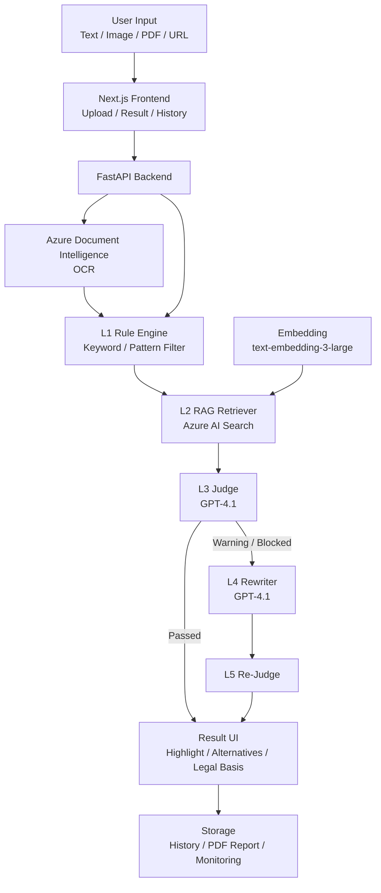

# 🛡️ AdGuard

### ✨ Azure AI & 클라우드 기반 화장품 광고 카피 검수 및 합법 대체 문구 제안 서비스

## ✨ Overview

AdGuard는 화장품 광고 카피가 실제 배포되기 전에 법적 리스크가 있는 표현을 탐지하고, 관련 법령 근거와 함께 실무에서 사용할 수 있는 대체 카피를 제안하는 Azure AI
 기반 광고 검수 서비스입니다.

사용자는 광고 텍스트를 직접 입력하거나 이미지, PDF, URL을 업로드할 수 있습니다. 이미지와 PDF는 Azure Document Intelligence로 광고 문구를 추출하고, 추출된 텍스트는 `text-embedding-3-large`와 Azure AI Search 기반 RAG 검색을 통해 관련 법령, 의결서, 가이드라인 근거와 매칭됩니다.

이후 GPT-4.1이 광고 문구의 위반 가능성을 판정하고, 위험 문구가 발견되면 안전형, 마케팅형, 기능성형 대체 카피 3종을 생성합니다. 생성된 수정안은 다시 검수 단계를 거쳐 재위반 가능성을 줄이며, 최종 결과는 위반 문구 하이라이트, 법적 근거, 수정안, PDF 리포트, 히스토리 형태로 제공됩니다.

## 📌 Contents

- [🎯 Problem](#problem)
- [🧭 Project Background](#project-background)
- [💼 Business Impact](#business-impact)
- [🚀 Key Features](#key-features)
- [🏗️ Architecture](#architecture)
- [🧰 Tech Stack](#tech-stack)
- [📊 Data and Metrics](#data-and-metrics)
- [👥 Team](#team)
- [🧩 Contributions](#contributions)
- [🤝 Responsible AI](#responsible-ai)
- [🗺️ Roadmap](#roadmap)

## 🎯 Problem

화장품 광고에서는 `바르는 보톡스`, `피부 재생`, `염증 완화`, `단 1회만에 개선`처럼 소비자가 제품을 의약품이나 시술로 오인할 수 있는 표현이 자주 등장합니다.

이러한 표현은 화장품법 및 표시광고법 위반으로 이어질 수 있으며, 실제 광고 중단, 행정처분, 브랜드 신뢰도 하락 같은 리스크를 만듭니다. 하지만 마케터나 소규모 브랜드가 매번 법령과 심의 기준을 직접 확인하며 광고 문구를 검수하기는 어렵습니다.

AdGuard는 광고 작성 단계에서 위험 문구 탐지, 법적 근거 제시, 대체 카피 생성을 한 번에 제공해 광고 검수 시간을 줄이고 실무자의 의사결정을 돕습니다.

## 🧭 Project Background

AdGuard는 "광고 카피 한 줄이 실제 비즈니스 리스크가 되는 문제"에서 출발했습니다. 화장품 광고는 소비자를 설득하고 구매를 유도하는 핵심 접점이지만, 효능 표현을 조금만 넘어서면 소비자가 제품을 의약품이나 시술처럼 오인할 수 있습니다.

`바르는 보톡스`, `피부 재생`, `염증 완화`, `4주의 기적`, `주름 박멸` 같은 표현은 마케팅 문구로는 매력적일 수 있지만, 화장품법과 표시광고법 관점에서는 의약품 오인, 기능성 오인, 수치·효과 과장으로 판단될 수 있습니다. 문제는 이런 위험 문구가 광고 작성 단계에서는 잘 보이지 않다가, 집행 이후 행정처분이나 광고 중단으로 이어진다는 점입니다.

### 🔍 Why This Problem Matters

| Icon | 배경 | 세부 내용 |
| --- | --- | --- |
| 📈 | 부당광고 증가 | 온라인 화장품 부당광고 적발건수는 2021년 1,913건에서 2025년 3,408건으로 증가했습니다. |
| 🧾 | 누적 리스크 확대 | 2021년부터 2025년까지 온라인 화장품 부당광고 누적 적발건수는 13,544건입니다. |
| ⚠️ | 위반 유형의 반복성 | 주요 위반 유형은 의약품 오인, 기능성 오인, 수치·효과 과장으로 반복됩니다. |
| 🧴 | 의약품 오인 급증 | 2025년 기준 의약품 오인 관련 적발은 약 2,526건으로 정리되었습니다. |
| 🛑 | 실제 처분 발생 | 2025년 화장품 행정처분 427건 중 표시·광고 위반은 324건으로 76%를 차지했습니다. |
| 🏢 | 브랜드 규모와 무관 | 대형 브랜드도 기능성 심사 결과와 다른 광고 표현으로 광고 중단 6개월 처분을 받은 사례가 있습니다. |

### 🧨 Pain Points

| Icon | 문제 | 설명 |
| --- | --- | --- |
| 🧑‍💻 | 마케터의 판단 부담 | 마케터는 좋은 카피를 빠르게 만들어야 하지만, 매번 법령과 심의 기준을 직접 확인하기 어렵습니다. |
| 📚 | 기준의 복잡성 | 화장품법, 표시광고법, 식약처 가이드라인, 공정위 의결서가 분산되어 있어 근거 확인이 오래 걸립니다. |
| 🧴 | 제품 유형별 판정 차이 | 일반 화장품과 기능성 화장품은 허용 가능한 효능 표현이 달라 동일 문구도 맥락별 판단이 필요합니다. |
| 🧾 | 증빙 자료 부족 | 광고 문구가 왜 위험한지, 어떤 근거로 수정해야 하는지 설명할 자료를 매번 수동으로 만들기 어렵습니다. |
| ⏱️ | 출시 일정 압박 | 신제품 출시 직전에는 빠른 검수가 필요하지만, 검토가 늦어지면 캠페인 일정과 매출에 영향을 줍니다. |

### ✅ Why AdGuard

AdGuard는 사후 적발 대응이 아니라, 광고 작성 단계에서 위험을 낮추는 사전 검수 엔진을 목표로 합니다. 단순히 "이 문구는 위험합니다"라고 알려주는 데서 끝나지 않고, 사용자가 바로 활용할 수 있는 합법 대체 카피까지 함께 제공합니다.

| 기존 방식 | 한계 | AdGuard의 접근 |
| --- | --- | --- |
| 수동 법령 검색 | 법령·가이드라인·처분 사례를 직접 찾아야 해 시간이 오래 걸림 | RAG 검색으로 관련 법령과 유사 사례를 자동 검색 |
| 범용 생성형 AI | 한국 화장품 광고 규제 맥락 반영이 불안정함 | 화장품 광고 규제에 특화된 Judge / Rewriter 구조 사용 |
| 사후 검수 | 이미 제작된 광고가 막히면 일정과 비용 손실 발생 | 작성 단계에서 위험 표현을 조기 탐지 |
| 단순 금지어 필터 | 맥락 판단과 합법 대체 문구 제안이 어려움 | L1 Rule + L2 RAG + L3 Judge + L4 Rewriter + L5 Re-Judge로 역할 분리 |

## 💼 Business Impact

AdGuard는 단순한 문장 검사 도구가 아니라, 화장품 브랜드와 광고 실무자가 광고 집행 전 리스크를 줄이고 더 빠르게 카피를 확정할 수 있도록 돕는 비즈니스 도구입니다. 핵심 가치는 `탐지`, `근거`, `대안`을 하나의 워크플로우로 제공한다는 점입니다.

### 📌 Market Opportunity

| Icon | 시장 근거 | 내용 |
| --- | --- | --- |
| 🌍 | 화장품 시장 성장 | 2026년 1분기 한국 화장품 수출은 31억 달러로 역대 분기 최대 수준으로 정리되었습니다. |
| 📣 | 광고 생산자 증가 | 1인 미디어 창작자 수가 2019년 대비 2023년 18.7배 증가하며 광고 콘텐츠 생산자가 빠르게 늘었습니다. |
| 🧑‍💼 | 소규모 사업자 중심 구조 | 국내 화장품 책임판매업체의 88%가 10명 미만 규모로, 법무·심의 전담 인력을 두기 어렵습니다. |
| ⚡ | 광고 생산 속도 증가 | 상세페이지, 숏폼, SNS, 배너 등 광고 채널이 늘면서 검수해야 할 문구량도 증가했습니다. |
| 🧭 | 규제 추적 부담 | 식약처 가이드라인과 심의 기준은 계속 바뀌기 때문에 마케터가 모든 기준을 상시 추적하기 어렵습니다. |

### 🎯 Target Users

| Icon | 대상 | 사용 상황 | 기대 효과 |
| --- | --- | --- | --- |
| 🧴 | 화장품 브랜드 | 제품 상세페이지, SNS 광고, 배너 카피 제작 전 검수 | 광고 중단과 행정처분 리스크를 사전에 줄임 |
| 📝 | 광고대행사 | 여러 고객사의 카피를 빠르게 비교·수정해야 하는 상황 | 검수 속도를 높이고 수정안 제안까지 한 번에 처리 |
| 👩‍💻 | 인하우스 마케터 | 출시 직전 카피가 법적으로 괜찮은지 빠르게 확인해야 하는 상황 | 법령 검색 없이 위반 사유와 수정안을 한 화면에서 확인 |
| 🛒 | 커머스 플랫폼 | 상품 등록·광고 업로드 단계에서 대량 문구 검수가 필요한 상황 | 벌크 검수 API로 위험 광고를 자동 차단하거나 경고 |
| 🏛️ | 규제/관리 조직 | 카테고리·판매자·시점별 위반 양상을 모니터링해야 하는 상황 | 리스크 대시보드와 리포트 기반으로 관리 효율 향상 |

### 🔁 Workflow Impact

| 단계 | 기존 업무 방식 | AdGuard 적용 후 |
| --- | --- | --- |
| 카피 작성 | 마케터가 감으로 위험 표현을 피하거나 동료에게 확인 | 위험 표현을 자동 하이라이트하고 위반 유형을 태깅 |
| 근거 확인 | 법령, 가이드라인, 의결서를 직접 검색 | Azure AI Search RAG로 관련 근거를 자동 검색 |
| 수정안 작성 | 안전하게 바꾸면 문구가 밋밋해지는 문제가 발생 | 안전형, 마케팅형, 기능성형 3가지 대체 카피 제공 |
| 내부 보고 | 위반 사유와 수정 근거를 별도 문서로 정리 | 법적 근거와 수정안이 포함된 PDF 리포트 자동 생성 |
| 사후 관리 | 검수 이력이 흩어져 재활용이 어려움 | History와 Feedback 데이터를 저장해 데이터 플라이휠 구축 |

### 🚀 Expected Impact

| Icon | 임팩트 | 설명 |
| --- | --- | --- |
| ⏱️ | 검수 시간 단축 | 마케터 테스트 기준 수동 검수 대비 체감 약 90% 시간 단축, 발표 자료 기준 2시간 작업을 약 30초 흐름으로 단축 |
| 🛡️ | 광고 집행 리스크 감소 | 위험 문구를 배포 전에 탐지해 광고 중단, 행정처분, 브랜드 신뢰 하락 리스크 완화 |
| ✍️ | 실무형 대체 카피 제공 | 단순히 문구를 막는 것이 아니라 브랜드 톤을 유지한 수정안 3종 제공 |
| 🧾 | 증빙 자료 자동화 | 법령 근거, 판단 사유, 수정안이 포함된 PDF 리포트 생성 |
| 📊 | 운영 데이터 축적 | 판정 이력과 사용자 선택 데이터를 저장해 향후 Few-shot 데이터로 재활용 |
| 🔌 | B2B 확장 가능성 | 광고 검수 API, 리스크 대시보드, 정책 엔진 커스터마이징으로 확장 가능 |

### 🧩 Product Positioning

| 비교 대상 | 강점 | 한계 | AdGuard의 차별점 |
| --- | --- | --- | --- |
| 법률 AI | 법령 검색과 법률 질의에 강함 | 광고 실무자가 바로 쓸 수 있는 대체 카피 제안은 부족 | 법령 근거와 대체 카피를 함께 제공 |
| 범용 생성형 AI | 문장 생성 속도가 빠름 | 한국 화장품 광고 규제 맥락 반영이 불안정 | 화장품 광고 위반 유형과 실제 사례 기반으로 판정 |
| 기관 사전심의 | 공신력 있는 판단 가능 | 승인까지 시간이 걸리고 작성 단계의 대안 제안이 어려움 | 광고 작성 단계에서 즉시 검수·수정 가능 |
| 단순 금지어 필터 | 빠르게 위험어 탐지 가능 | 맥락 판단, 근거 인용, 대안 생성이 어려움 | 5-Layer Cascade로 탐지·근거·대안·재검증까지 연결 |

### 🔌 Expansion Strategy

| 단계 | 확장 방향 | 설명 |
| --- | --- | --- |
| 1단계 | 화장품 광고 검수 | 텍스트, 이미지, PDF, URL 기반 카피 검수 |
| 2단계 | 커머스 플랫폼 연동 | 상품 등록·광고 업로드 단계에서 API 기반 자동 검수 |
| 3단계 | 리스크 대시보드 | 브랜드, 판매자, 카테고리, 시점별 위반 지표 모니터링 |
| 4단계 | 정책 엔진 커스터마이징 | 플랫폼 자체 가이드라인과 브랜드 용어 사전 반영 |
| 5단계 | 규제 도메인 확장 | 건강기능식품, 의료광고 등 다른 규제 산업으로 확장 |

AdGuard의 장기적인 비즈니스 가치는 광고 검수 자동화를 넘어, 광고 리스크 데이터를 축적하고 조직별 정책에 맞게 커스터마이징할 수 있는 B2B 컴플라이언스 인프라로 확장할 수 있다는 점에 있습니다.

## 🚀 Key Features

| Icon | 기능 | 설명 |
| --- | --- | --- |
| 📝 | 텍스트 분석 | 광고 카피를 직접 입력해 위반 가능성을 분석 |
| 🖼️ | OCR 분석 | 이미지/PDF 업로드 시 Azure Document Intelligence로 광고 문구 추출 |
| 🔗 | URL 분석 | URL 기반 광고 문구 수집 및 분석 |
| ⚡ | Rule Engine | 금지어와 위험 패턴을 L1 단계에서 빠르게 탐지 |
| 🔎 | RAG 검색 | Azure AI Search로 법령, 의결서, 가이드라인 근거 검색 |
| 🧠 | GPT 판정 | GPT-4.1이 검색 근거를 바탕으로 위반 여부와 사유 판정 |
| ✍️ | 대체 카피 생성 | 안전형, 마케팅형, 기능성형 수정안 3종 생성 |
| ✅ | Re-Judge | 생성된 수정안을 다시 검수해 재위반 가능성 감소 |
| 🧾 | 결과 UI | 위반 문구 하이라이트, Before/After 비교, 법적 근거 제공 |
| 📁 | 리포트/히스토리 | PDF 리포트와 검수 기록 저장 |

## 🏗️ Architecture

AdGuard는 단일 GPT 호출이 아니라 역할을 분리한 5-Layer Cascade 구조로 설계되었습니다.
<svg width="1920" height="1080" xmlns="http://www.w3.org/2000/svg" xmlns:xlink="http://www.w3.org/1999/xlink" xml:space="preserve" overflow="hidden"><defs><clipPath id="clip0"><rect x="0" y="0" width="1920" height="1080"/></clipPath><clipPath id="clip1"><path d="M216.52 459.012 228.852 474.266 213.911 486.856 201.579 471.603Z" fill-rule="evenodd" clip-rule="evenodd"/></clipPath><clipPath id="clip2"><path d="M351.708 396.187 362.454 379.73 378.573 390.701 367.827 407.158Z" fill-rule="evenodd" clip-rule="evenodd"/></clipPath></defs><g clip-path="url(#clip0)"><path d="M0 0 2020.33 0 2020.33 1245.41 0 1245.41Z" fill="#FAFBFC" transform="matrix(1 0 0 1.02093 -60.6099 0)"/><text fill="#0F172A" font-family="Pretendard,Pretendard_MSFontService,sans-serif" font-weight="700" font-size="32" transform="matrix(1.38379 0 0 1.41275 22.4174 85)">AdGuard · Runtime Architecture</text><text fill="#64748B" font-family="Pretendard,Pretendard_MSFontService,sans-serif" font-weight="400" font-size="16" transform="matrix(1.38379 0 0 1.41275 22.4174 130)">화장품 광고 컴플라이언스 검수 파이프라인 </text><text fill="#64748B" font-family="Pretendard,Pretendard_MSFontService,sans-serif" font-weight="400" font-size="16" transform="matrix(1.38379 0 0 1.41275 394.635 130)">· L</text><text fill="#64748B" font-family="Pretendard,Pretendard_MSFontService,sans-serif" font-weight="400" font-size="16" transform="matrix(1.38379 0 0 1.41275 417.618 130)">0 </text><text fill="#64748B" font-family="Pretendard,Pretendard_MSFontService,sans-serif" font-weight="400" font-size="16" transform="matrix(1.38379 0 0 1.41275 436.364 130)">~ </text><text fill="#64748B" font-family="Pretendard,Pretendard_MSFontService,sans-serif" font-weight="400" font-size="16" transform="matrix(1.38379 0 0 1.41275 455.802 130)">L</text><text fill="#64748B" font-family="Pretendard,Pretendard_MSFontService,sans-serif" font-weight="400" font-size="16" transform="matrix(1.38379 0 0 1.41275 467.608 130)">5</text><path d="M1948.37 179.892C1965.19 179.892 1978.82 193.522 1978.82 210.336L1978.82 979.721C1978.82 996.535 1965.19 1010.16 1948.37 1010.16L348.714 1010.16C331.901 1010.16 318.271 996.535 318.271 979.721L318.271 210.336C318.271 193.522 331.901 179.892 348.714 179.892Z" stroke="#CBD5E1" stroke-width="2.07568" stroke-dasharray="9.68651 5.53515" fill="#F1F5FB" transform="matrix(1 0 0 1.02093 -60.6099 0)"/><text fill="#64748B" font-family="Pretendard,Pretendard_MSFontService,sans-serif" font-weight="700" font-size="14" transform="matrix(1.38379 0 0 1.41275 285.337 229)">AZURE PLATFORM</text><g><path d="M73.802 36.901C73.802 47.0909 65.5414 55.3515 55.3515 55.3515 45.1616 55.3515 36.901 47.0909 36.901 36.901 36.901 26.7111 45.1616 18.4505 55.3515 18.4505 65.5414 18.4505 73.802 26.7111 73.802 36.901Z" fill="#0F172A" transform="matrix(1 0 0 1.02093 36.2552 282.551)"/><path d="M18.4505 95.9426C18.4505 73.802 30.7509 62.7317 55.3515 62.7317 79.9521 62.7317 92.2525 73.802 92.2525 95.9426Z" fill="#0F172A" transform="matrix(1 0 0 1.02093 36.2552 282.551)"/></g><text fill="#0F172A" font-family="Pretendard,Pretendard_MSFontService,sans-serif" font-weight="700" font-size="18" transform="matrix(1.38379 0 0 1.41275 59.3161 432)">마케터</text><text fill="#64748B" font-family="Pretendard,Pretendard_MSFontService,sans-serif" font-weight="400" font-size="12" transform="matrix(1.38379 0 0 1.41275 60.8202 463)">광고 카피</text><text fill="#4B5563" font-family="Pretendard,Pretendard_MSFontService,sans-serif" font-weight="700" font-size="11" transform="matrix(1.38379 0 0 1.41275 53.062 489)">일반 </text><text fill="#4B5563" font-family="Pretendard,Pretendard_MSFontService,sans-serif" font-weight="700" font-size="11" transform="matrix(1.38379 0 0 1.41275 82.881 489)">· </text><text fill="#4B5563" font-family="Pretendard,Pretendard_MSFontService,sans-serif" font-weight="700" font-size="11" transform="matrix(1.38379 0 0 1.41275 90.6851 489)">기능성</text><path d="M221.406 318.271 408.217 318.271" stroke="#334155" stroke-width="3.04433" fill="none" transform="matrix(1 0 0 1.02093 -60.6099 0)"/><g><path d="M0 0 21.3103 10.6552 0 21.3103Z" fill="#334155" transform="matrix(1 0 0 1.02093 330.559 314.055)"/></g><text fill="#475569" font-family="Pretendard,Pretendard_MSFontService,sans-serif" font-weight="400" font-size="13" transform="matrix(1.38379 0 0 1.41275 175.984 308)">POST </text><text fill="#475569" font-family="Pretendard,Pretendard_MSFontService,sans-serif" font-weight="400" font-size="13" transform="matrix(1.38379 0 0 1.41275 226.368 308)">/</text><text fill="#475569" font-family="Pretendard,Pretendard_MSFontService,sans-serif" font-weight="400" font-size="13" transform="matrix(1.38379 0 0 1.41275 232.376 308)">analyze</text><text fill="#475569" font-family="Pretendard,Pretendard_MSFontService,sans-serif" font-weight="400" font-size="13" transform="matrix(1.38379 0 0 1.41275 293.977 308)">/</text><text fill="#475569" font-family="Pretendard,Pretendard_MSFontService,sans-serif" font-weight="400" font-size="13" transform="matrix(1.38379 0 0 1.41275 299.985 308)">text</text><path d="M207.568 380.542 279.525 467.72" stroke="#0891B2" stroke-width="2.76757" stroke-dasharray="6.91894 4.15136" transform="matrix(1 0 0 1.02093 -60.6099 0)"/><g clip-path="url(#clip1)"><path d="M0 0 19.5343 9.76716 0 19.5343Z" fill="#0891B2" transform="matrix(0.631309 0.780865 -0.764855 0.644524 216.52 459.012)"/></g><g><path d="M24.2163 67.8056C13.4535 67.8056 8.07209 62.4242 8.07209 51.6614 8.07209 43.0512 12.3772 37.6697 20.9874 35.5172 22.0638 24.7544 28.5215 19.373 40.3605 19.373 51.1233 19.373 57.581 23.6782 59.7335 32.2884 71.5725 32.2884 78.5684 37.1316 80.7209 46.8181 89.3311 47.8945 93.6363 52.7377 93.6363 61.3479 93.6363 69.9581 88.2549 74.2633 77.4921 74.2633L29.0595 74.2633C25.8307 74.2633 24.2163 72.1107 24.2163 67.8056Z" fill="#0078D4" transform="matrix(1 0 0 1.02093 216.148 459.145)"/></g><text fill="#0F172A" font-family="Pretendard,Pretendard_MSFontService,sans-serif" font-weight="700" font-size="14" transform="matrix(1.38379 0 0 1.41275 191.198 589)">Doc Intelligence</text><text fill="#0891B2" font-family="Pretendard,Pretendard_MSFontService,sans-serif" font-weight="700" font-size="11" transform="matrix(1.38379 0 0 1.41275 169.742 615)">Azure OCR · </text><text fill="#0891B2" font-family="Pretendard,Pretendard_MSFontService,sans-serif" font-weight="700" font-size="11" transform="matrix(1.38379 0 0 1.41275 259.437 615)">이미지 </text><text fill="#0891B2" font-family="Pretendard,Pretendard_MSFontService,sans-serif" font-weight="700" font-size="11" transform="matrix(1.38379 0 0 1.41275 302.411 615)">→ </text><text fill="#0891B2" font-family="Pretendard,Pretendard_MSFontService,sans-serif" font-weight="700" font-size="11" transform="matrix(1.38379 0 0 1.41275 319.952 615)">텍스트</text><path d="M370.855 467.72 428.974 380.542" stroke="#0891B2" stroke-width="2.76757" stroke-dasharray="6.91894 4.15136" transform="matrix(1 0 0 1.02093 -60.6099 0)"/><g clip-path="url(#clip2)"><path d="M0 0 19.4951 9.74757 0 19.4951Z" fill="#0891B2" transform="matrix(0.551226 -0.844146 0.826839 0.562764 351.708 396.187)"/></g><g><path d="M27.6757 77.4921C15.3754 77.4921 9.22525 71.342 9.22525 59.0416 9.22525 49.2014 14.1454 43.0511 23.9856 40.5911 25.2157 28.2907 32.5959 22.1406 46.1262 22.1406 58.4266 22.1406 65.8068 27.0608 68.2668 36.901 81.7971 36.901 89.7925 42.4361 92.2525 53.5064 102.093 54.7365 107.013 60.2717 107.013 70.1119 107.013 79.9521 100.863 84.8723 88.5624 84.8723L33.2109 84.8723C29.5208 84.8723 27.6757 82.4123 27.6757 77.4921Z" fill="#0078D4" transform="matrix(1 0 0 1.02093 354.526 282.551)"/></g><text fill="#0F172A" font-family="Pretendard,Pretendard_MSFontService,sans-serif" font-weight="700" font-size="18" transform="matrix(1.38379 0 0 1.41275 364.677 432)">FastAPI</text><text fill="#64748B" font-family="Pretendard,Pretendard_MSFontService,sans-serif" font-weight="400" font-size="13" transform="matrix(1.38379 0 0 1.41275 361.216 463)">App Service</text><path d="M539.677 332.109 712.651 332.109" stroke="#334155" stroke-width="3.04433" fill="none" transform="matrix(1 0 0 1.02093 -60.6099 0)"/><g><path d="M0 0 21.3103 10.6552 0 21.3103Z" fill="#334155" transform="matrix(1 0 0 1.02093 634.992 328.183)"/></g><text fill="#475569" font-family="Pretendard,Pretendard_MSFontService,sans-serif" font-weight="400" font-size="13" transform="matrix(1.38379 0 0 1.41275 529.424 322)">Dispatch</text><g><path d="M38.746 55.3515C38.746 62.4844 32.9636 68.2668 25.8307 68.2668 18.6977 68.2668 12.9153 62.4844 12.9153 55.3515 12.9153 48.2185 18.6977 42.4361 25.8307 42.4361 32.9636 42.4361 38.746 48.2185 38.746 55.3515Z" fill="#8B5CF6" transform="matrix(1 0 0 1.02093 658.96 282.551)"/><path d="M97.7876 25.8307C97.7876 32.9636 92.0052 38.746 84.8723 38.746 77.7393 38.746 71.9569 32.9636 71.9569 25.8307 71.9569 18.6977 77.7393 12.9153 84.8723 12.9153 92.0052 12.9153 97.7876 18.6977 97.7876 25.8307Z" fill="#8B5CF6" transform="matrix(1 0 0 1.02093 658.96 282.551)"/><path d="M97.7876 84.8723C97.7876 92.0052 92.0052 97.7876 84.8723 97.7876 77.7393 97.7876 71.9569 92.0052 71.9569 84.8723 71.9569 77.7393 77.7393 71.9569 84.8723 71.9569 92.0052 71.9569 97.7876 77.7393 97.7876 84.8723Z" fill="#8B5CF6" transform="matrix(1 0 0 1.02093 658.96 282.551)"/><path d="M36.901 51.6614 73.802 29.5208" stroke="#8B5CF6" stroke-width="5.53515" transform="matrix(1 0 0 1.02093 658.96 282.551)"/><path d="M36.901 59.0416 73.802 81.1822" stroke="#8B5CF6" stroke-width="5.53515" transform="matrix(1 0 0 1.02093 658.96 282.551)"/></g><text fill="#0F172A" font-family="Pretendard,Pretendard_MSFontService,sans-serif" font-weight="700" font-size="18" transform="matrix(1.38379 0 0 1.41275 657.337 432)">L</text><text fill="#0F172A" font-family="Pretendard,Pretendard_MSFontService,sans-serif" font-weight="700" font-size="18" transform="matrix(1.38379 0 0 1.41275 670.935 432)">0 </text><text fill="#0F172A" font-family="Pretendard,Pretendard_MSFontService,sans-serif" font-weight="700" font-size="18" transform="matrix(1.38379 0 0 1.41275 693.118 432)">Router</text><text fill="#64748B" font-family="Pretendard,Pretendard_MSFontService,sans-serif" font-weight="400" font-size="13" transform="matrix(1.38379 0 0 1.41275 648.547 463)">Product Context</text><path d="M844.11 332.109 1017.08 332.109" stroke="#334155" stroke-width="3.04433" fill="none" transform="matrix(1 0 0 1.02093 -60.6099 0)"/><g><path d="M0 0 21.3103 10.6552 0 21.3103Z" fill="#334155" transform="matrix(1 0 0 1.02093 939.426 328.183)"/></g><text fill="#475569" font-family="Pretendard,Pretendard_MSFontService,sans-serif" font-weight="400" font-size="13" transform="matrix(1.38379 0 0 1.41275 849.251 322)">Scan</text><g><path d="M55.3515 11.0703 18.4505 25.8307 18.4505 55.3515C18.4505 72.5719 30.7509 87.3323 55.3515 99.6327 79.9521 87.3323 92.2525 72.5719 92.2525 55.3515L92.2525 25.8307Z" fill="#6366F1" transform="matrix(1 0 0 1.02093 963.393 282.551)"/><path d="M40.5911 55.3515 51.6614 66.4218 73.802 40.5911" stroke="#FFFFFF" stroke-width="7.3802" stroke-linecap="round" stroke-linejoin="round" fill="none" transform="matrix(1 0 0 1.02093 963.393 282.551)"/></g><text fill="#0F172A" font-family="Pretendard,Pretendard_MSFontService,sans-serif" font-weight="700" font-size="18" transform="matrix(1.38379 0 0 1.41275 977.587 432)">L</text><text fill="#0F172A" font-family="Pretendard,Pretendard_MSFontService,sans-serif" font-weight="700" font-size="18" transform="matrix(1.38379 0 0 1.41275 991.185 432)">1 </text><text fill="#0F172A" font-family="Pretendard,Pretendard_MSFontService,sans-serif" font-weight="700" font-size="18" transform="matrix(1.38379 0 0 1.41275 1008.6 432)">Rule</text><text fill="#64748B" font-family="Pretendard,Pretendard_MSFontService,sans-serif" font-weight="400" font-size="13" transform="matrix(1.38379 0 0 1.41275 941.609 463)">hard</text><text fill="#64748B" font-family="Pretendard,Pretendard_MSFontService,sans-serif" font-weight="400" font-size="13" transform="matrix(1.38379 0 0 1.41275 977.965 463)">_</text><text fill="#64748B" font-family="Pretendard,Pretendard_MSFontService,sans-serif" font-weight="400" font-size="13" transform="matrix(1.38379 0 0 1.41275 985.607 463)">block </text><text fill="#64748B" font-family="Pretendard,Pretendard_MSFontService,sans-serif" font-weight="400" font-size="13" transform="matrix(1.38379 0 0 1.41275 1033.69 463)">바이너리</text><path d="M1148.54 332.109 1321.52 332.109" stroke="#334155" stroke-width="3.04433" fill="none" transform="matrix(1 0 0 1.02093 -60.6099 0)"/><g><path d="M0 0 21.3103 10.6552 0 21.3103Z" fill="#334155" transform="matrix(1 0 0 1.02093 1243.86 328.183)"/></g><text fill="#475569" font-family="Pretendard,Pretendard_MSFontService,sans-serif" font-weight="400" font-size="14" transform="matrix(1.38379 0 0 1.41275 1138.26 322)">Retrieve</text><g><path d="M70.1119 44.2812C70.1119 58.5471 58.5471 70.1119 44.2812 70.1119 30.0153 70.1119 18.4505 58.5471 18.4505 44.2812 18.4505 30.0153 30.0153 18.4505 44.2812 18.4505 58.5471 18.4505 70.1119 30.0153 70.1119 44.2812Z" stroke="#06B6D4" stroke-width="9.22525" fill="none" transform="matrix(1 0 0 1.02093 1267.83 282.551)"/><path d="M59.0416 44.2812C59.0416 52.4331 52.4331 59.0416 44.2812 59.0416 36.1293 59.0416 29.5208 52.4331 29.5208 44.2812 29.5208 36.1293 36.1293 29.5208 44.2812 29.5208 52.4331 29.5208 59.0416 36.1293 59.0416 44.2812Z" fill="#67E8F9" fill-opacity="0.6" transform="matrix(1 0 0 1.02093 1267.83 282.551)"/><path d="M62.7317 62.7317 92.2525 92.2525" stroke="#06B6D4" stroke-width="9.22525" stroke-linecap="round" transform="matrix(1 0 0 1.02093 1267.83 282.551)"/></g><text fill="#0F172A" font-family="Pretendard,Pretendard_MSFontService,sans-serif" font-weight="700" font-size="18" transform="matrix(1.38379 0 0 1.41275 1252.58 432)">L</text><text fill="#0F172A" font-family="Pretendard,Pretendard_MSFontService,sans-serif" font-weight="700" font-size="18" transform="matrix(1.38379 0 0 1.41275 1266.17 432)">2 </text><text fill="#0F172A" font-family="Pretendard,Pretendard_MSFontService,sans-serif" font-weight="700" font-size="18" transform="matrix(1.38379 0 0 1.41275 1287.12 432)">Retriever</text><text fill="#0078D4" font-family="Pretendard,Pretendard_MSFontService,sans-serif" font-weight="700" font-size="13" transform="matrix(1.38379 0 0 1.41275 1255.24 463)">Azure AI Search</text><path d="M1452.98 332.109 1625.95 332.109" stroke="#334155" stroke-width="3.04433" fill="none" transform="matrix(1 0 0 1.02093 -60.6099 0)"/><g><path d="M0 0 21.3103 10.6552 0 21.3103Z" fill="#334155" transform="matrix(1 0 0 1.02093 1548.29 328.183)"/></g><text fill="#475569" font-family="Pretendard,Pretendard_MSFontService,sans-serif" font-weight="400" font-size="14" transform="matrix(1.38379 0 0 1.41275 1438.48 322)">Evidence</text><g><path d="M60.8866 25.8307C61.9056 25.8307 62.7317 26.6568 62.7317 27.6757L62.7317 90.4074C62.7317 91.4264 61.9056 92.2525 60.8866 92.2525L49.8163 92.2525C48.7974 92.2525 47.9713 91.4264 47.9713 90.4074L47.9713 27.6757C47.9713 26.6568 48.7974 25.8307 49.8163 25.8307Z" fill="#D97706" transform="matrix(1 0 0 1.02093 1572.26 282.551)"/><path d="M18.4505 33.2109 92.2525 33.2109" stroke="#D97706" stroke-width="7.3802" stroke-linecap="round" fill="none" transform="matrix(1 0 0 1.02093 1572.26 282.551)"/><path d="M18.4505 33.2109 7.3802 55.3515 29.5208 55.3515Z" fill="#F59E0B" transform="matrix(1 0 0 1.02093 1572.26 282.551)"/><path d="M92.2525 33.2109 81.1822 55.3515 103.323 55.3515Z" fill="#F59E0B" transform="matrix(1 0 0 1.02093 1572.26 282.551)"/><path d="M75.647 92.2525C76.666 92.2525 77.4921 93.0786 77.4921 94.0975L77.4921 99.6327C77.4921 100.652 76.666 101.478 75.647 101.478L35.0559 101.478C34.037 101.478 33.2109 100.652 33.2109 99.6327L33.2109 94.0975C33.2109 93.0786 34.037 92.2525 35.0559 92.2525Z" fill="#D97706" transform="matrix(1 0 0 1.02093 1572.26 282.551)"/></g><text fill="#0F172A" font-family="Pretendard,Pretendard_MSFontService,sans-serif" font-weight="700" font-size="18" transform="matrix(1.38379 0 0 1.41275 1573.4 432)">L</text><text fill="#0F172A" font-family="Pretendard,Pretendard_MSFontService,sans-serif" font-weight="700" font-size="18" transform="matrix(1.38379 0 0 1.41275 1587 432)">3 </text><text fill="#0F172A" font-family="Pretendard,Pretendard_MSFontService,sans-serif" font-weight="700" font-size="18" transform="matrix(1.38379 0 0 1.41275 1608.65 432)">Judge</text><text fill="#D97706" font-family="Pretendard,Pretendard_MSFontService,sans-serif" font-weight="700" font-size="13" transform="matrix(1.38379 0 0 1.41275 1530.96 463)">Azure OpenAI · gpt</text><text fill="#D97706" font-family="Pretendard,Pretendard_MSFontService,sans-serif" font-weight="700" font-size="13" transform="matrix(1.38379 0 0 1.41275 1690.85 463)">-</text><text fill="#D97706" font-family="Pretendard,Pretendard_MSFontService,sans-serif" font-weight="700" font-size="13" transform="matrix(1.38379 0 0 1.41275 1698.93 463)">4</text><text fill="#D97706" font-family="Pretendard,Pretendard_MSFontService,sans-serif" font-weight="700" font-size="13" transform="matrix(1.38379 0 0 1.41275 1710.75 463)">.</text><text fill="#D97706" font-family="Pretendard,Pretendard_MSFontService,sans-serif" font-weight="700" font-size="13" transform="matrix(1.38379 0 0 1.41275 1715.83 463)">1</text><path d="M1688.22 467.72 1688.22 595.029" stroke="#334155" stroke-width="3.04433" fill="none" transform="matrix(1 0 0 1.02093 -60.6099 0)"/><g><path d="M0 0 21.3103 10.6552 0 21.3103Z" fill="#334155" transform="matrix(6.12323e-17 1.02093 -1 6.25141e-17 1638.27 590.079)"/></g><text fill="#475569" font-family="Pretendard,Pretendard_MSFontService,sans-serif" font-weight="400" font-size="14" transform="matrix(1.38379 0 0 1.41275 1666.36 551)">Verdict</text><text fill="#0F172A" font-family="Pretendard,Pretendard_MSFontService,sans-serif" font-weight="700" font-size="22" transform="matrix(1.38379 0 0 1.41275 1512.94 657)">Decision Engine</text><path d="M1688.22 671.137 1688.22 802.597" stroke="#334155" stroke-width="3.04433" fill="none" transform="matrix(1 0 0 1.02093 -60.6099 0)"/><g><path d="M0 0 21.3103 10.6552 0 21.3103Z" fill="#334155" transform="matrix(6.12323e-17 1.02093 -1 6.25141e-17 1638.27 801.992)"/></g><text fill="#475569" font-family="Pretendard,Pretendard_MSFontService,sans-serif" font-weight="400" font-size="14" transform="matrix(1.38379 0 0 1.41275 1666.36 763)">Rewrite</text><g><path d="M18.4505 92.2525 27.6757 70.1119 77.4921 20.2955 90.4074 33.2109 40.5911 83.0272Z" fill="#DB2777" transform="matrix(1 0 0 1.02093 1572.26 819.397)"/><path d="M87.6109 18.6406C88.6404 18.6406 89.4749 19.4752 89.4749 20.5047L89.4749 27.9609C89.4749 28.9904 88.6404 29.825 87.6109 29.825L72.6984 29.825C71.6689 29.825 70.8343 28.9904 70.8343 27.9609L70.8343 20.5047C70.8343 19.4752 71.6689 18.6406 72.6984 18.6406Z" fill="#9D174D" transform="matrix(0.699895 0.714546 -0.699895 0.714546 1612.46 769.295)"/><path d="M18.4505 92.2525 27.6757 70.1119 40.5911 83.0272Z" fill="#FBCFE8" transform="matrix(1 0 0 1.02093 1572.26 819.397)"/></g><text fill="#0F172A" font-family="Pretendard,Pretendard_MSFontService,sans-serif" font-weight="700" font-size="18" transform="matrix(1.38379 0 0 1.41275 1560.09 969)">L</text><text fill="#0F172A" font-family="Pretendard,Pretendard_MSFontService,sans-serif" font-weight="700" font-size="18" transform="matrix(1.38379 0 0 1.41275 1573.69 969)">4 </text><text fill="#0F172A" font-family="Pretendard,Pretendard_MSFontService,sans-serif" font-weight="700" font-size="18" transform="matrix(1.38379 0 0 1.41275 1595.8 969)">Rewriter</text><text fill="#DB2777" font-family="Pretendard,Pretendard_MSFontService,sans-serif" font-weight="700" font-size="13" transform="matrix(1.38379 0 0 1.41275 1530.96 1000)">Azure OpenAI · gpt</text><text fill="#DB2777" font-family="Pretendard,Pretendard_MSFontService,sans-serif" font-weight="700" font-size="13" transform="matrix(1.38379 0 0 1.41275 1690.85 1000)">-</text><text fill="#DB2777" font-family="Pretendard,Pretendard_MSFontService,sans-serif" font-weight="700" font-size="13" transform="matrix(1.38379 0 0 1.41275 1698.93 1000)">4</text><text fill="#DB2777" font-family="Pretendard,Pretendard_MSFontService,sans-serif" font-weight="700" font-size="13" transform="matrix(1.38379 0 0 1.41275 1710.75 1000)">.</text><text fill="#DB2777" font-family="Pretendard,Pretendard_MSFontService,sans-serif" font-weight="700" font-size="13" transform="matrix(1.38379 0 0 1.41275 1715.83 1000)">1</text><path d="M150.833 0C159.24-2.4581e-15 166.054 6.81497 166.054 15.2217L166.054 15.2217C166.054 23.6284 159.24 30.4433 150.833 30.4433L15.2217 30.4433C6.81497 30.4433 0 23.6284 0 15.2217L0 15.2217C-2.4581e-15 6.81497 6.81497-2.4581e-15 15.2217-4.9162e-15Z" stroke="#DB2777" stroke-width="1.66055" fill="#FCE7F3" transform="matrix(1 0 0 1.02093 1544.58 1022.83)"/><text fill="#9D174D" font-family="Pretendard,Pretendard_MSFontService,sans-serif" font-weight="700" font-size="11" transform="matrix(1.38379 0 0 1.41275 1551.79 1044)">← </text><text fill="#9D174D" font-family="Pretendard,Pretendard_MSFontService,sans-serif" font-weight="700" font-size="11" transform="matrix(1.38379 0 0 1.41275 1569.33 1044)">L</text><text fill="#9D174D" font-family="Pretendard,Pretendard_MSFontService,sans-serif" font-weight="700" font-size="11" transform="matrix(1.38379 0 0 1.41275 1577.64 1044)">3 </text><text fill="#9D174D" font-family="Pretendard,Pretendard_MSFontService,sans-serif" font-weight="700" font-size="11" transform="matrix(1.38379 0 0 1.41275 1590.87 1044)">힌트 </text><text fill="#9D174D" font-family="Pretendard,Pretendard_MSFontService,sans-serif" font-weight="700" font-size="11" transform="matrix(1.38379 0 0 1.41275 1620.69 1044)">+ </text><text fill="#9D174D" font-family="Pretendard,Pretendard_MSFontService,sans-serif" font-weight="700" font-size="11" transform="matrix(1.38379 0 0 1.41275 1634.14 1044)">경계어 회피</text><path d="M1625.95 857.948 1452.98 857.948" stroke="#334155" stroke-width="3.04433" fill="none" transform="matrix(1 0 0 1.02093 -60.6099 0)"/><g><path d="M0 0 21.3103 10.6552 0 21.3103Z" fill="#334155" transform="matrix(-1 1.25028e-16 -1.22465e-16 -1.02093 1409.42 886.785)"/></g><text fill="#475569" font-family="Pretendard,Pretendard_MSFontService,sans-serif" font-weight="400" font-size="14" transform="matrix(1.38379 0 0 1.41275 1438.6 859)">Re</text><text fill="#475569" font-family="Pretendard,Pretendard_MSFontService,sans-serif" font-weight="400" font-size="14" transform="matrix(1.38379 0 0 1.41275 1460.99 859)">-</text><text fill="#475569" font-family="Pretendard,Pretendard_MSFontService,sans-serif" font-weight="400" font-size="14" transform="matrix(1.38379 0 0 1.41275 1469.37 859)">verify</text><g><path d="M81.1822 14.7604C89.3341 14.7604 95.9426 21.3689 95.9426 29.5208L95.9426 81.1822C95.9426 89.3341 89.3341 95.9426 81.1822 95.9426L29.5208 95.9426C21.3689 95.9426 14.7604 89.3341 14.7604 81.1822L14.7604 29.5208C14.7604 21.3689 21.3689 14.7604 29.5208 14.7604Z" fill="#10B981" transform="matrix(1 0 0 1.02093 1267.83 819.397)"/><path d="M33.2109 55.3515 49.8163 71.9569 81.1822 40.5911" stroke="#FFFFFF" stroke-width="9.22525" stroke-linecap="round" stroke-linejoin="round" fill="none" transform="matrix(1 0 0 1.02093 1267.83 819.397)"/></g><text fill="#0F172A" font-family="Pretendard,Pretendard_MSFontService,sans-serif" font-weight="700" font-size="18" transform="matrix(1.38379 0 0 1.41275 1257.82 969)">L</text><text fill="#0F172A" font-family="Pretendard,Pretendard_MSFontService,sans-serif" font-weight="700" font-size="18" transform="matrix(1.38379 0 0 1.41275 1271.42 969)">5 </text><text fill="#0F172A" font-family="Pretendard,Pretendard_MSFontService,sans-serif" font-weight="700" font-size="18" transform="matrix(1.38379 0 0 1.41275 1292.77 969)">Rejudge</text><text fill="#D97706" font-family="Pretendard,Pretendard_MSFontService,sans-serif" font-weight="700" font-size="13" transform="matrix(1.38379 0 0 1.41275 1258.65 1000)">L</text><text fill="#D97706" font-family="Pretendard,Pretendard_MSFontService,sans-serif" font-weight="700" font-size="13" transform="matrix(1.38379 0 0 1.41275 1268.47 1000)">1 </text><text fill="#D97706" font-family="Pretendard,Pretendard_MSFontService,sans-serif" font-weight="700" font-size="13" transform="matrix(1.38379 0 0 1.41275 1281.05 1000)">+ </text><text fill="#D97706" font-family="Pretendard,Pretendard_MSFontService,sans-serif" font-weight="700" font-size="13" transform="matrix(1.38379 0 0 1.41275 1296.94 1000)">L</text><text fill="#D97706" font-family="Pretendard,Pretendard_MSFontService,sans-serif" font-weight="700" font-size="13" transform="matrix(1.38379 0 0 1.41275 1306.76 1000)">3</text><text fill="#D97706" font-family="Pretendard,Pretendard_MSFontService,sans-serif" font-weight="700" font-size="13" transform="matrix(1.38379 0 0 1.41275 1318.25 1000)">-</text><text fill="#D97706" font-family="Pretendard,Pretendard_MSFontService,sans-serif" font-weight="700" font-size="13" transform="matrix(1.38379 0 0 1.41275 1326.34 1000)">lite </text><text fill="#D97706" font-family="Pretendard,Pretendard_MSFontService,sans-serif" font-weight="700" font-size="13" transform="matrix(1.38379 0 0 1.41275 1356.61 1000)">병렬</text><text fill="#64748B" font-family="Pretendard,Pretendard_MSFontService,sans-serif" font-weight="400" font-size="11" transform="matrix(1.38379 0 0 1.41275 1260.13 1024)">수정안 </text><text fill="#64748B" font-family="Pretendard,Pretendard_MSFontService,sans-serif" font-weight="400" font-size="11" transform="matrix(1.38379 0 0 1.41275 1303.41 1024)">3</text><text fill="#64748B" font-family="Pretendard,Pretendard_MSFontService,sans-serif" font-weight="400" font-size="11" transform="matrix(1.38379 0 0 1.41275 1312.81 1024)">개 동시 검증</text><path d="M10.3784 5.53515C10.3784 8.21001 8.21001 10.3784 5.53515 10.3784 2.86029 10.3784 0.691894 8.21001 0.691894 5.53515 0.691894 2.86029 2.86029 0.691894 5.53515 0.691894 8.21001 0.691894 10.3784 2.86029 10.3784 5.53515Z" fill="#10B981" transform="matrix(1 0 0 1.02093 1287.2 1041.2)"/><path d="M35.2866 5.53515C35.2866 8.21001 33.1182 10.3784 30.4433 10.3784 27.7685 10.3784 25.6001 8.21001 25.6001 5.53515 25.6001 2.86029 27.7685 0.691894 30.4433 0.691894 33.1182 0.691894 35.2866 2.86029 35.2866 5.53515Z" fill="#F59E0B" transform="matrix(1 0 0 1.02093 1287.2 1041.2)"/><path d="M60.1948 5.53515C60.1948 8.21001 58.0263 10.3784 55.3515 10.3784 52.6766 10.3784 50.5082 8.21001 50.5082 5.53515 50.5082 2.86029 52.6766 0.691894 55.3515 0.691894 58.0263 0.691894 60.1948 2.86029 60.1948 5.53515Z" fill="#DC2626" transform="matrix(1 0 0 1.02093 1287.2 1041.2)"/><path d="M85.1029 5.53515C85.1029 8.21001 82.9345 10.3784 80.2597 10.3784 77.5848 10.3784 75.4164 8.21001 75.4164 5.53515 75.4164 2.86029 77.5848 0.691894 80.2597 0.691894 82.9345 0.691894 85.1029 2.86029 85.1029 5.53515Z" fill="#94A3B8" transform="matrix(1 0 0 1.02093 1287.2 1041.2)"/><path d="M1321.52 857.948 1148.54 857.948" stroke="#334155" stroke-width="3.04433" fill="none" transform="matrix(1 0 0 1.02093 -60.6099 0)"/><g><path d="M0 0 21.3103 10.6552 0 21.3103Z" fill="#334155" transform="matrix(-1 1.25028e-16 -1.22465e-16 -1.02093 1104.98 886.785)"/></g><text fill="#475569" font-family="Pretendard,Pretendard_MSFontService,sans-serif" font-weight="400" font-size="13" transform="matrix(1.38379 0 0 1.41275 1143.58 859)">Finalize</text><g><path d="M22.1406 11.0703 70.1119 11.0703 92.2525 33.2109 92.2525 99.6327 22.1406 99.6327Z" stroke="#0F172A" stroke-width="3.6901" fill="#FFFFFF" transform="matrix(1 0 0 1.02093 963.393 819.397)"/><path d="M70.1119 11.0703 70.1119 33.2109 92.2525 33.2109" stroke="#0F172A" stroke-width="3.6901" fill="#E2E8F0" transform="matrix(1 0 0 1.02093 963.393 819.397)"/><path d="M33.2109 51.6614 77.4921 51.6614" stroke="#94A3B8" stroke-width="3.6901" fill="none" transform="matrix(1 0 0 1.02093 963.393 819.397)"/><path d="M33.2109 66.4218 77.4921 66.4218" stroke="#94A3B8" stroke-width="3.6901" fill="none" transform="matrix(1 0 0 1.02093 963.393 819.397)"/><path d="M33.2109 81.1822 62.7317 81.1822" stroke="#94A3B8" stroke-width="3.6901" fill="none" transform="matrix(1 0 0 1.02093 963.393 819.397)"/></g><text fill="#0F172A" font-family="Pretendard,Pretendard_MSFontService,sans-serif" font-weight="700" font-size="18" transform="matrix(1.38379 0 0 1.41275 960.889 969)">Response</text><text fill="#64748B" font-family="Pretendard,Pretendard_MSFontService,sans-serif" font-weight="400" font-size="13" transform="matrix(1.38379 0 0 1.41275 995.652 1000)">JSON</text><path d="M1017.08 857.948 844.11 857.948" stroke="#334155" stroke-width="3.04433" fill="none" transform="matrix(1 0 0 1.02093 -60.6099 0)"/><g><path d="M0 0 21.3103 10.6552 0 21.3103Z" fill="#334155" transform="matrix(-1 1.25028e-16 -1.22465e-16 -1.02093 800.549 886.785)"/></g><text fill="#475569" font-family="Pretendard,Pretendard_MSFontService,sans-serif" font-weight="400" font-size="13" transform="matrix(1.38379 0 0 1.41275 840.462 859)">Render</text><g><path d="M97.7876 18.4505C100.845 18.4505 103.323 20.9287 103.323 23.9856L103.323 79.3371C103.323 82.3941 100.845 84.8723 97.7876 84.8723L12.9153 84.8723C9.85837 84.8723 7.3802 82.3941 7.3802 79.3371L7.3802 23.9856C7.3802 20.9287 9.85837 18.4505 12.9153 18.4505Z" stroke="#0F172A" stroke-width="4.61262" fill="#FFFFFF" transform="matrix(1 0 0 1.02093 658.96 819.397)"/><path d="M14.7604 25.8307 95.9426 25.8307 95.9426 77.4921 14.7604 77.4921Z" fill="#DBEAFE" transform="matrix(1 0 0 1.02093 658.96 819.397)"/><path d="M40.5911 47.9713C40.5911 52.0473 37.2869 55.3515 33.2109 55.3515 29.1349 55.3515 25.8307 52.0473 25.8307 47.9713 25.8307 43.8953 29.1349 40.5911 33.2109 40.5911 37.2869 40.5911 40.5911 43.8953 40.5911 47.9713Z" fill="#10B981" transform="matrix(1 0 0 1.02093 658.96 819.397)"/><path d="M51.6614 36.901 88.5624 36.901 88.5624 42.4361 51.6614 42.4361Z" fill="#94A3B8" transform="matrix(1 0 0 1.02093 658.96 819.397)"/><path d="M51.6614 47.9713 81.1822 47.9713 81.1822 53.5064 51.6614 53.5064Z" fill="#94A3B8" transform="matrix(1 0 0 1.02093 658.96 819.397)"/><path d="M51.6614 59.0416 88.5624 59.0416 88.5624 64.5767 51.6614 64.5767Z" fill="#94A3B8" transform="matrix(1 0 0 1.02093 658.96 819.397)"/><path d="M40.5911 84.8723 70.1119 84.8723 77.4921 99.6327 33.2109 99.6327Z" fill="#0F172A" transform="matrix(1 0 0 1.02093 658.96 819.397)"/></g><text fill="#0F172A" font-family="Pretendard,Pretendard_MSFontService,sans-serif" font-weight="700" font-size="18" transform="matrix(1.38379 0 0 1.41275 702.234 969)">UI</text><text fill="#0078D4" font-family="Pretendard,Pretendard_MSFontService,sans-serif" font-weight="700" font-size="13" transform="matrix(1.38379 0 0 1.41275 621.558 1000)">Azure Static Web App</text><path d="M712.651 857.948 297.514 857.948" stroke="#64748B" stroke-width="2.76757" fill="none" transform="matrix(1 0 0 1.02093 -60.6099 0)"/><g><path d="M0 0 19.373 9.68651 0 19.373Z" fill="#334155" transform="matrix(-1 1.25028e-16 -1.22465e-16 -1.02093 252.403 885.796)"/></g><text fill="#64748B" font-family="Pretendard,Pretendard_MSFontService,sans-serif" font-weight="400" font-size="12" transform="matrix(1.38379 0 0 1.41275 401.078 859)">GET </text><text fill="#64748B" font-family="Pretendard,Pretendard_MSFontService,sans-serif" font-weight="400" font-size="12" transform="matrix(1.38379 0 0 1.41275 436.591 859)">/</text><text fill="#64748B" font-family="Pretendard,Pretendard_MSFontService,sans-serif" font-weight="400" font-size="12" transform="matrix(1.38379 0 0 1.41275 442.137 859)">report</text><g><path d="M19.373 9.68651 61.3479 9.68651 80.7209 29.0595 80.7209 87.1786 19.373 87.1786Z" stroke="#0F172A" stroke-width="3.22884" fill="#FFFFFF" transform="matrix(1 0 0 1.02093 133.12 833.524)"/><path d="M61.3479 9.68651 61.3479 29.0595 80.7209 29.0595" stroke="#0F172A" stroke-width="3.22884" fill="#E2E8F0" transform="matrix(1 0 0 1.02093 133.12 833.524)"/><path d="M29.0595 45.2037 67.8056 45.2037" stroke="#94A3B8" stroke-width="3.22884" fill="none" transform="matrix(1 0 0 1.02093 133.12 833.524)"/><path d="M29.0595 58.1191 67.8056 58.1191" stroke="#94A3B8" stroke-width="3.22884" fill="none" transform="matrix(1 0 0 1.02093 133.12 833.524)"/><path d="M29.0595 71.0344 54.8902 71.0344" stroke="#94A3B8" stroke-width="3.22884" fill="none" transform="matrix(1 0 0 1.02093 133.12 833.524)"/></g><text fill="#0F172A" font-family="Pretendard,Pretendard_MSFontService,sans-serif" font-weight="700" font-size="15" transform="matrix(1.38379 0 0 1.41275 126.56 963)">PDF Report</text><text fill="#64748B" font-family="Pretendard,Pretendard_MSFontService,sans-serif" font-weight="400" font-size="11" transform="matrix(1.38379 0 0 1.41275 122.885 989)">reportlab · </text><text fill="#64748B" font-family="Pretendard,Pretendard_MSFontService,sans-serif" font-weight="400" font-size="11" transform="matrix(1.38379 0 0 1.41275 196.934 989)">앱 로직</text><path d="M1328.44 802.597 1328.44 768.002 837.191 768.002 837.191 262.92 1079.35 262.92 1079.35 276.757" stroke="#0891B2" stroke-width="2.21406" stroke-dasharray="8.30272 5.53515" fill="none" transform="matrix(1 0 0 1.02093 -60.6099 0)"/><g><path d="M0 0 15.4984 7.74921 0 15.4984Z" fill="#0891B2" transform="matrix(6.12323e-17 1.02093 -1 6.25141e-17 1026.49 269.892)"/></g><text fill="#0891B2" font-family="Pretendard,Pretendard_MSFontService,sans-serif" font-weight="700" font-size="11" transform="matrix(1.38379 0 0 1.41275 935.717 259)">L</text><text fill="#0891B2" font-family="Pretendard,Pretendard_MSFontService,sans-serif" font-weight="700" font-size="11" transform="matrix(1.38379 0 0 1.41275 944.026 259)">1 </text><text fill="#0891B2" font-family="Pretendard,Pretendard_MSFontService,sans-serif" font-weight="700" font-size="11" transform="matrix(1.38379 0 0 1.41275 954.67 259)">재확인</text><path d="M1439.14 802.597 1439.14 768.002 1964.98 768.002 1964.98 262.92 1688.22 262.92 1688.22 276.757" stroke="#0891B2" stroke-width="2.21406" stroke-dasharray="8.30272 5.53515" fill="none" transform="matrix(1 0 0 1.02093 -60.6099 0)"/><g><path d="M0 0 15.4984 7.74921 0 15.4984Z" fill="#0891B2" transform="matrix(6.12323e-17 1.02093 -1 6.25141e-17 1635.36 269.892)"/></g><text fill="#0891B2" font-family="Pretendard,Pretendard_MSFontService,sans-serif" font-weight="700" font-size="11" transform="matrix(1.38379 0 0 1.41275 1634.53 259)">L</text><text fill="#0891B2" font-family="Pretendard,Pretendard_MSFontService,sans-serif" font-weight="700" font-size="11" transform="matrix(1.38379 0 0 1.41275 1642.84 259)">3</text><text fill="#0891B2" font-family="Pretendard,Pretendard_MSFontService,sans-serif" font-weight="700" font-size="11" transform="matrix(1.38379 0 0 1.41275 1652.56 259)">-</text><text fill="#0891B2" font-family="Pretendard,Pretendard_MSFontService,sans-serif" font-weight="700" font-size="11" transform="matrix(1.38379 0 0 1.41275 1659.4 259)">lite </text><text fill="#0891B2" font-family="Pretendard,Pretendard_MSFontService,sans-serif" font-weight="700" font-size="11" transform="matrix(1.38379 0 0 1.41275 1685.02 259)">재판정</text><path d="M1134.71 387.46 1176.22 387.46 1176.22 636.542 1383.79 636.542 1383.79 774.921 1625.95 774.921 1625.95 799.829" stroke="#F59E0B" stroke-width="3.32109" stroke-dasharray="9.68651 6.91894" fill="none" transform="matrix(1 0 0 1.02093 -60.6099 0)"/><g><path d="M0 0 23.2476 11.6238 0 23.2476Z" fill="#F59E0B" transform="matrix(6.12323e-17 1.02093 -1 6.25141e-17 1576.96 797.584)"/></g><path d="M189.579 0C199.514-2.4581e-15 207.568 8.05406 207.568 17.9892L207.568 17.9892C207.568 27.9244 199.514 35.9785 189.579 35.9785L17.9892 35.9785C8.05406 35.9785-4.9162e-15 27.9244-4.9162e-15 17.9892L-4.9162e-15 17.9892C-7.3743e-15 8.05406 8.05406-4.9162e-15 17.9892-4.9162e-15Z" stroke="#F59E0B" stroke-width="2.07568" fill="#FEF3C7" transform="matrix(1 0 0 1.02093 1115.61 604.658)"/><text fill="#92400E" font-family="Pretendard,Pretendard_MSFontService,sans-serif" font-weight="700" font-size="12" transform="matrix(1.38379 0 0 1.41275 1131.72 630)">Fast Mode · L</text><text fill="#92400E" font-family="Pretendard,Pretendard_MSFontService,sans-serif" font-weight="700" font-size="12" transform="matrix(1.38379 0 0 1.41275 1234.69 630)">2</text><text fill="#92400E" font-family="Pretendard,Pretendard_MSFontService,sans-serif" font-weight="700" font-size="12" transform="matrix(1.38379 0 0 1.41275 1244.82 630)">/</text><text fill="#92400E" font-family="Pretendard,Pretendard_MSFontService,sans-serif" font-weight="700" font-size="12" transform="matrix(1.38379 0 0 1.41275 1250.99 630)">L</text><text fill="#92400E" font-family="Pretendard,Pretendard_MSFontService,sans-serif" font-weight="700" font-size="12" transform="matrix(1.38379 0 0 1.41275 1260.05 630)">3 </text><text fill="#92400E" font-family="Pretendard,Pretendard_MSFontService,sans-serif" font-weight="700" font-size="12" transform="matrix(1.38379 0 0 1.41275 1274.48 630)">skip</text></g></svg>

### 🧬 5-Layer Cascade

| Icon | Layer | 역할 | 설명 |
| --- | --- | --- | --- |
| ⚡ | L1 Rule Engine | 빠른 위험 표현 탐지 | 금지어, 수치 단정, 의료/시술 오인 표현을 규칙 기반으로 탐지 |
| 🔎 | L2 RAG Retriever | 근거 검색 | Azure AI Search로 법령, 의결서, 가이드라인 근거 검색 |
| 🧠 | L3 Judge | 위반 여부 판정 | GPT-4.1이 RAG 근거를 바탕으로 위험도와 법적 근거 판정 |
| ✍️ | L4 Rewriter | 수정안 생성 | 위반 문구를 안전형, 마케팅형, 기능성형 카피로 변환 |
| ✅ | L5 Re-Judge | 수정안 재검수 | 생성된 수정안을 다시 판정해 재위반 가능성 감소 |

## 🧰 Tech Stack

| Icon | 영역 | 기술 |
| --- | --- | --- |
| 🧠 | AI Model | Azure OpenAI GPT-4.1 |
| 🧬 | Embedding | Azure OpenAI text-embedding-3-large |
| 🔎 | Search | Azure AI Search |
| 🖼️ | OCR | Azure Document Intelligence |
| 🔁 | AI Workflow | Azure AI Foundry, RAG Pipeline |
| ⚙️ | Backend | FastAPI, Azure App Service |
| 🎨 | Frontend | Next.js 14, shadcn/ui |
| 🚀 | Deploy | Azure Static Web Apps |
| 🗄️ | Storage | Azure Blob Storage, Azure SQL Database / Azure Table Storage |
| 🔐 | Security | Azure Key Vault |
| 📈 | Monitoring | Azure Application Insights |
| 🧹 | Data Processing | Python Custom Chunker |

## 📊 Data and Metrics

| Icon | 항목 | 결과 |
| --- | --- | --- |
| 📚 | 원본 데이터 | 42 PDF + 60 MD + 32 TXT |
| ✂️ | RAG 청크 | 1,069개 |
| 🔎 | Azure AI Search 인덱스 | `adguard-main` |
| 🧬 | 임베딩 모델 | `text-embedding-3-large` |
| 📐 | 벡터 차원 | 3,072차원 |
| 🧪 | Few-shot 데이터 | 254행 |
| ⚡ | L1 Rule Engine 테스트 | 24/25 통과 |
| 🧠 | Cascade 테스트 | 10건 중 9건 정확 |
| 🏁 | 내부 평가 | 67건 기준 핵심 지표 100% 달성 |
| ⏱️ | 작업 시간 개선 | 수동 검수 대비 체감 약 90% 단축 |

## 👥 Team

| Icon | 이름 | 역할 | 주요 담당 |
| --- | --- | --- | --- |
| 🧭 | 오준상 | 팀장 / AI·시스템 총괄 | L1~L5 Cascade 파이프라인 설계, Azure AI Search RAG 구조 설계, 법령·의결서 데이터 청킹/임베딩/인덱싱 전략, 모델 구조 최적화, 아키텍처 및 성능 검증 |
| 🎨 | 황유경 | 프론트엔드 | Result / History 페이지 구현, 수정안 3종 카드 UI, 신호등 위험도 Badge, Before/After Diff UI, 위반 문구 하이라이트 및 책임있는 AI UI 개선 |
| ⚙️ | 오효석 | 백엔드 | FastAPI 서버 구축, L1~L3 분석 파이프라인 구현, Azure 리소스 생성, API 연결 및 최적화, 병렬 처리와 배포 안정화 |
| 🧪 | 조윤지 | 데이터 / AI 보조 | 화장품 광고 위반/정상 사례 수집, Few-shot 데이터셋 구축, L4 Rewriter 스타일 기준 정리, 광고 카피 카테고리 분류와 발표 흐름 보강 |
| 🖼️ | 김시현 | 프론트엔드 | Upload 페이지 구현, Azure Document Intelligence OCR 연동, 이미지/PDF 업로드 UX, L1~L5 분석 단계 로딩 시각화, Azure Static Web Apps 배포 |
| 🗄️ | 백혁빈 | 백엔드 / 데이터 | L1~L5 파이프라인 구현 지원, Rewriter / Re-Judge 로직 개발, PDF 리포트 생성, DB 저장 구조, 히스토리 기능, 보안·모니터링 구조 정리 |

## 🧩 Contributions

### 🧭 오준상

팀장으로서 AdGuard의 AI 파이프라인과 전체 시스템 아키텍처를 총괄했습니다. 단순히 GPT-4.1에 광고 문구를 한 번 입력해 판단하는 구조가 아니라, 빠른 규칙 기반 탐지, 법령 근거 검색, LLM 판정, 대체 카피 생성, 재검증을 분리한 5-Layer Cascade 구조를 설계했습니다.

또한 법령, 의결서, 가이드라인, 광고 사례 데이터를 RAG 검색에 적합하도록 청킹하고, `text-embedding-3-large`와 Azure AI Search를 활용해 검색 가능한 형태로 구성하는 전략을 정리했습니다. 발표와 구현 과정에서는 아키텍처 흐름, 모델 판단 구조, 성능 검증 기준, 팀원별 역할 분배를 조율했습니다.

### 🎨 황유경

Result / History 페이지를 중심으로 사용자가 분석 결과를 이해하고 다시 활용할 수 있는 UI를 구현했습니다. GPT-4.1이 생성한 수정안 3종을 카드 형태로 보여주고, 위험도를 신호등 Badge와 텍스트로 함께 표시해 결과를 빠르게 파악할 수 있도록 구성했습니다.

Before/After 비교 UI에서는 원본 광고 문구와 AI 수정안을 나란히 배치하고, 위반 의심 문구를 하이라이트해 사용자가 어떤 부분이 문제인지 직관적으로 이해할 수 있게 했습니다. 또한 색상에만 의존하지 않는 위험도 표시, 설명 가능한 AI UI, 사용자 피드백 흐름 등 책임있는 AI 원칙을 프론트엔드 경험에 반영했습니다.

### ⚙️ 오효석

FastAPI 기반 백엔드 서버와 L1~L3 분석 파이프라인을 구축했습니다. 광고 문구 입력을 받아 Rule Engine, Azure AI Search Retriever, GPT-4.1 Judge로 이어지는 초기 판정 흐름을 구성하고, 프론트엔드와 API가 연결될 수 있도록 서버 구조를 정리했습니다.

Azure 리소스 생성과 환경 변수 설정, API 연결, 모델 결합 테스트, 병렬 처리와 배포 안정화 작업을 담당했습니다. 분석 요청이 실제 서비스 흐름에서 안정적으로 처리될 수 있도록 백엔드 성능과 운영 안정성을 개선했습니다.

### 🧪 조윤지

AdGuard의 판단 품질과 대체 카피 품질을 높이기 위한 데이터셋 구축을 담당했습니다. 실제 화장품 광고의 위반 사례와 정상 사례를 수집하고, 의약품 오인, 기능성 오인, 수치·효과 과장 등 주요 위반 유형을 정리했습니다.

Few-shot 데이터셋과 L4 Rewriter 스타일 기준을 구성해 GPT-4.1이 단순히 방어적인 문구만 생성하지 않고, 법적 기준 안에서 마케팅 가치가 살아 있는 대체 카피를 만들 수 있도록 지원했습니다. 또한 발표 흐름에서 서비스 가치와 사용 시나리오를 설명하는 파트를 보강했습니다.

### 🖼️ 김시현

사용자가 광고 문구를 입력하는 Upload 페이지와 OCR 기반 입력 UX를 구현했습니다. 텍스트 입력뿐 아니라 이미지와 PDF 업로드를 지원하고, Azure Document Intelligence를 연동해 파일 속 광고 문구를 자동으로 추출하는 흐름을 구성했습니다.

분석 과정에서는 L1~L5 단계가 어떻게 진행되는지 사용자가 볼 수 있도록 로딩 상태와 진행 메시지를 시각화했습니다. 또한 데이터 처리 동의 체크박스, 드래그 앤 드롭 업로드, 썸네일 미리보기, Azure Static Web Apps 배포 등 실제 사용성과 배포 완성도를 높이는 작업을 담당했습니다.

### 🗄️ 백혁빈

백엔드 파이프라인과 데이터 저장 구조를 중심으로 구현을 담당했습니다. L1~L5 분석 흐름이 서비스 안에서 연결될 수 있도록 Rewriter와 Re-Judge 로직을 개발하고, 생성된 대체 카피가 다시 검수되는 구조를 정리했습니다.

PDF 리포트 생성 기능과 검수 히스토리 저장 구조를 구현해 분석 결과가 단순 화면 출력에 그치지 않고, 보고 자료와 사후 관리 데이터로 남을 수 있도록 했습니다. 또한 DB 저장, 보안 처리, 모니터링 구조를 정리해 서비스 운영 안정성을 높였습니다.

## 🤝 Responsible AI

AdGuard는 Microsoft Responsible AI 원칙을 서비스 기능에 반영했습니다.

| Icon | 원칙 | 적용 방식 |
| --- | --- | --- |
| 🔍 | 투명성 | L1~L5 분석 단계를 사용자에게 실시간으로 표시 |
| 💬 | 설명 가능성 | 위반 문구와 법적 근거를 함께 제공 |
| 🧾 | 책임성 | 최종 판단 책임이 사용자에게 있음을 명시 |
| ⚖️ | 공정성 | 일반 화장품과 기능성 화장품을 구분해 판정 기준 적용 |
| 🛡️ | 안정성 | 생성된 수정안을 다시 검수하는 Re-Judge 구조 적용 |
| 🔐 | 개인정보 보호 | 광고 카피와 제품 정보 외 불필요한 개인정보 수집 최소화 |
| ♿ | 포용성 | 색상뿐 아니라 아이콘과 텍스트를 함께 사용해 위험도 표시 |

## 🗺️ Roadmap

- 건강기능식품, 의료광고 등 규제 도메인 확장
- 쇼핑몰/광고대행사 대상 B2B API 제공
- 검수 히스토리 기반 대시보드 고도화
- 수정안 선택 데이터를 활용한 Few-shot 데이터 플라이휠 구축
- 스트리밍과 캐싱을 통한 응답 시간 개선

## 🧾 Project Summary

AdGuard는 Azure AI 기반 화장품 광고 검수 서비스입니다. 광고 카피, 이미지, PDF, URL을 입력하면 `text-embedding-3-large`와 Azure AI Search 기반 법령·의결서·가이드라인 RAG 검색으로 위반 가능성을 판정하고, GPT-4.1을 활용해 안전한 대체 카피 3종과 PDF 리포트를 제공합니다.

- 기간: 2026.04.13 ~ 2026.04.27
- 기술: Azure OpenAI GPT-4.1, Azure OpenAI text-embedding-3-large, Azure AI Search, Azure Document Intelligence, FastAPI, Next.js, Azure App Service, Azure Static Web Apps
