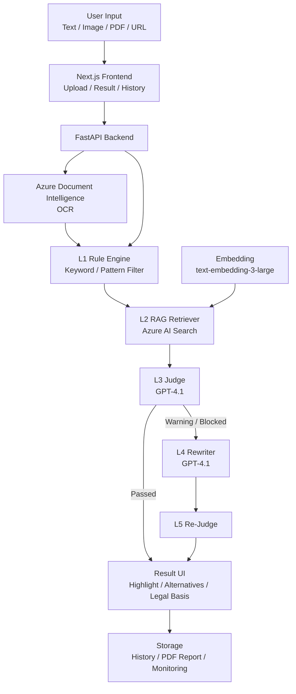

<div align="center">

# 🛡️ AdGuard

### ✨ Azure AI & 클라우드 기반 화장품 광고 카피 검수 및 합법 대체 문구 제안 서비스


</div>

<a id="overview"></a>

## ✨ Overview


AdGuard는 화장품 광고 카피가 실제 배포되기 전에 법적 리스크가 있는 표현을 탐지하고, 관련 법령 근거와 함께 실무에서 사용할 수 있는 대체 카피를 제안하는 Azure AI & 클라우드 기반 광고 검수 서비스입니다.

사용자는 광고 텍스트를 직접 입력하거나 이미지, PDF, URL을 업로드할 수 있습니다. 이미지와 PDF는 Azure Document Intelligence로 광고 문구를 추출하고, 추출된 텍스트는 `text-embedding-3-large`와 Azure AI Search 기반 RAG 검색을 통해 관련 법령, 의결서, 가이드라인 근거와 매칭됩니다.

이후 GPT-4.1이 광고 문구의 위반 가능성을 판정하고, 위험 문구가 발견되면 안전형, 마케팅형, 기능성형 대체 카피 3종을 생성합니다. 생성된 수정안은 다시 검수 단계를 거쳐 재위반 가능성을 줄이며, 최종 결과는 위반 문구 하이라이트, 법적 근거, 수정안, PDF 리포트, 히스토리 형태로 제공됩니다.

<a id="contents"></a>

## 📌 Contents

- [🎯 Problem](#problem)
- [🧭 Project Background](#project-background)
- [💼 Business Impact](#business-impact)
- [🚀 Key Features](#key-features)
- [🎛️ Functional UI & UX](#functional-ui-ux)
- [🏗️ Architecture](#architecture)
- [🧰 Tech Stack](#tech-stack)
- [📁 Folder Structure](#folder-structure)
- [📊 Data and Metrics](#data-and-metrics)
- [👥 Team](#team)
- [🧩 Contributions](#contributions)
- [🤝 Responsible AI](#responsible-ai)
- [🗺️ Roadmap](#roadmap)

<a id="problem"></a>

## 🎯 Problem

화장품 광고에서는 `바르는 보톡스`, `피부 재생`, `염증 완화`, `단 1회만에 개선`처럼 소비자가 제품을 의약품이나 시술로 오인할 수 있는 표현이 자주 등장합니다.

이러한 표현은 화장품법 및 표시광고법 위반으로 이어질 수 있으며, 실제 광고 중단, 행정처분, 브랜드 신뢰도 하락 같은 리스크를 만듭니다. 하지만 마케터나 소규모 브랜드가 매번 법령과 심의 기준을 직접 확인하며 광고 문구를 검수하기는 어렵습니다.

AdGuard는 광고 작성 단계에서 위험 문구 탐지, 법적 근거 제시, 대체 카피 생성을 한 번에 제공해 광고 검수 시간을 줄이고 실무자의 의사결정을 돕습니다.

<a id="project-background"></a>

## 🧭 Project Background

AdGuard는 "광고 카피 한 줄이 실제 비즈니스 리스크가 되는 문제"에서 출발했습니다. 화장품 광고는 소비자를 설득하고 구매를 유도하는 핵심 접점이지만, 효능 표현을 조금만 넘어서면 소비자가 제품을 의약품이나 시술처럼 오인할 수 있습니다.

`바르는 보톡스`, `피부 재생`, `염증 완화`, `4주의 기적`, `주름 박멸` 같은 표현은 마케팅 문구로는 매력적일 수 있지만, 화장품법과 표시광고법 관점에서는 의약품 오인, 기능성 오인, 수치·효과 과장으로 판단될 수 있습니다. 문제는 이런 위험 문구가 광고 작성 단계에서는 잘 보이지 않다가, 집행 이후 행정처분이나 광고 중단으로 이어진다는 점입니다.

### 🔍 Why This Problem Matters

| Icon | 배경 | 세부 내용 |
| --- | --- | --- |
| 📈 | 부당광고 증가 | 온라인 화장품 부당광고 적발건수는 2021년 1,913건에서 2025년 3,408건으로 증가했습니다. |
| 🧾 | 누적 리스크 확대 | 2021년부터 2025년까지 온라인 화장품 부당광고 누적 적발건수는 13,544건입니다. |
| ⚠️ | 위반 유형의 반복성 | 주요 위반 유형은 의약품 오인, 기능성 오인, 수치·효과 과장으로 반복됩니다. |
| 🧴 | 의약품 오인 급증 | 2025년 기준 의약품 오인 관련 적발은 약 2,526건으로 정리되었습니다. |
| 🛑 | 실제 처분 발생 | 2025년 화장품 행정처분 427건 중 표시·광고 위반은 324건으로 76%를 차지했습니다. |
| 🏢 | 브랜드 규모와 무관 | 대형 브랜드도 기능성 심사 결과와 다른 광고 표현으로 광고 중단 6개월 처분을 받은 사례가 있습니다. |

### 🧨 Pain Points

| Icon | 문제 | 설명 |
| --- | --- | --- |
| 🧑‍💻 | 마케터의 판단 부담 | 마케터는 좋은 카피를 빠르게 만들어야 하지만, 매번 법령과 심의 기준을 직접 확인하기 어렵습니다. |
| 📚 | 기준의 복잡성 | 화장품법, 표시광고법, 식약처 가이드라인, 공정위 의결서가 분산되어 있어 근거 확인이 오래 걸립니다. |
| 🧴 | 제품 유형별 판정 차이 | 일반 화장품과 기능성 화장품은 허용 가능한 효능 표현이 달라 동일 문구도 맥락별 판단이 필요합니다. |
| 🧾 | 증빙 자료 부족 | 광고 문구가 왜 위험한지, 어떤 근거로 수정해야 하는지 설명할 자료를 매번 수동으로 만들기 어렵습니다. |
| ⏱️ | 출시 일정 압박 | 신제품 출시 직전에는 빠른 검수가 필요하지만, 검토가 늦어지면 캠페인 일정과 매출에 영향을 줍니다. |

### ✅ Why AdGuard

AdGuard는 사후 적발 대응이 아니라, 광고 작성 단계에서 위험을 낮추는 사전 검수 엔진을 목표로 합니다. 단순히 "이 문구는 위험합니다"라고 알려주는 데서 끝나지 않고, 사용자가 바로 활용할 수 있는 합법 대체 카피까지 함께 제공합니다.

| 기존 방식 | 한계 | AdGuard의 접근 |
| --- | --- | --- |
| 수동 법령 검색 | 법령·가이드라인·처분 사례를 직접 찾아야 해 시간이 오래 걸림 | RAG 검색으로 관련 법령과 유사 사례를 자동 검색 |
| 범용 생성형 AI | 한국 화장품 광고 규제 맥락 반영이 불안정함 | 화장품 광고 규제에 특화된 Judge / Rewriter 구조 사용 |
| 사후 검수 | 이미 제작된 광고가 막히면 일정과 비용 손실 발생 | 작성 단계에서 위험 표현을 조기 탐지 |
| 단순 금지어 필터 | 맥락 판단과 합법 대체 문구 제안이 어려움 | L1 Rule + L2 RAG + L3 Judge + L4 Rewriter + L5 Re-Judge로 역할 분리 |

<a id="business-impact"></a>

## 💼 Business Impact

AdGuard는 단순한 문장 검사 도구가 아니라, 화장품 브랜드와 광고 실무자가 광고 집행 전 리스크를 줄이고 더 빠르게 카피를 확정할 수 있도록 돕는 비즈니스 도구입니다. 핵심 가치는 `탐지`, `근거`, `대안`을 하나의 워크플로우로 제공한다는 점입니다.

### 📌 Market Opportunity

| Icon | 시장 근거 | 내용 |
| --- | --- | --- |
| 🌍 | 화장품 시장 성장 | 2026년 1분기 한국 화장품 수출은 31억 달러로 역대 분기 최대 수준으로 정리되었습니다. |
| 📣 | 광고 생산자 증가 | 1인 미디어 창작자 수가 2019년 대비 2023년 18.7배 증가하며 광고 콘텐츠 생산자가 빠르게 늘었습니다. |
| 🧑‍💼 | 소규모 사업자 중심 구조 | 국내 화장품 책임판매업체의 88%가 10명 미만 규모로, 법무·심의 전담 인력을 두기 어렵습니다. |
| ⚡ | 광고 생산 속도 증가 | 상세페이지, 숏폼, SNS, 배너 등 광고 채널이 늘면서 검수해야 할 문구량도 증가했습니다. |
| 🧭 | 규제 추적 부담 | 식약처 가이드라인과 심의 기준은 계속 바뀌기 때문에 마케터가 모든 기준을 상시 추적하기 어렵습니다. |

### 🎯 Target Users

| Icon | 대상 | 사용 상황 | 기대 효과 |
| --- | --- | --- | --- |
| 🧴 | 화장품 브랜드 | 제품 상세페이지, SNS 광고, 배너 카피 제작 전 검수 | 광고 중단과 행정처분 리스크를 사전에 줄임 |
| 📝 | 광고대행사 | 여러 고객사의 카피를 빠르게 비교·수정해야 하는 상황 | 검수 속도를 높이고 수정안 제안까지 한 번에 처리 |
| 👩‍💻 | 인하우스 마케터 | 출시 직전 카피가 법적으로 괜찮은지 빠르게 확인해야 하는 상황 | 법령 검색 없이 위반 사유와 수정안을 한 화면에서 확인 |
| 🛒 | 커머스 플랫폼 | 상품 등록·광고 업로드 단계에서 대량 문구 검수가 필요한 상황 | 벌크 검수 API로 위험 광고를 자동 차단하거나 경고 |
| 🏛️ | 규제/관리 조직 | 카테고리·판매자·시점별 위반 양상을 모니터링해야 하는 상황 | 리스크 대시보드와 리포트 기반으로 관리 효율 향상 |

### 🔁 Workflow Impact

| 단계 | 기존 업무 방식 | AdGuard 적용 후 |
| --- | --- | --- |
| 카피 작성 | 마케터가 감으로 위험 표현을 피하거나 동료에게 확인 | 위험 표현을 자동 하이라이트하고 위반 유형을 태깅 |
| 근거 확인 | 법령, 가이드라인, 의결서를 직접 검색 | Azure AI Search RAG로 관련 근거를 자동 검색 |
| 수정안 작성 | 안전하게 바꾸면 문구가 밋밋해지는 문제가 발생 | 안전형, 마케팅형, 기능성형 3가지 대체 카피 제공 |
| 내부 보고 | 위반 사유와 수정 근거를 별도 문서로 정리 | 법적 근거와 수정안이 포함된 PDF 리포트 자동 생성 |
| 사후 관리 | 검수 이력이 흩어져 재활용이 어려움 | History와 Feedback 데이터를 저장해 데이터 플라이휠 구축 |

### 🚀 Expected Impact

| Icon | 임팩트 | 설명 |
| --- | --- | --- |
| ⏱️ | 검수 시간 단축 | 마케터 테스트 기준 수동 검수 대비 체감 약 90% 시간 단축, 발표 자료 기준 2시간 작업을 약 30초 흐름으로 단축 |
| 🛡️ | 광고 집행 리스크 감소 | 위험 문구를 배포 전에 탐지해 광고 중단, 행정처분, 브랜드 신뢰 하락 리스크 완화 |
| ✍️ | 실무형 대체 카피 제공 | 단순히 문구를 막는 것이 아니라 브랜드 톤을 유지한 수정안 3종 제공 |
| 🧾 | 증빙 자료 자동화 | 법령 근거, 판단 사유, 수정안이 포함된 PDF 리포트 생성 |
| 📊 | 운영 데이터 축적 | 판정 이력과 사용자 선택 데이터를 저장해 향후 Few-shot 데이터로 재활용 |
| 🔌 | B2B 확장 가능성 | 광고 검수 API, 리스크 대시보드, 정책 엔진 커스터마이징으로 확장 가능 |

### 🧩 Product Positioning

| 비교 대상 | 강점 | 한계 | AdGuard의 차별점 |
| --- | --- | --- | --- |
| 법률 AI | 법령 검색과 법률 질의에 강함 | 광고 실무자가 바로 쓸 수 있는 대체 카피 제안은 부족 | 법령 근거와 대체 카피를 함께 제공 |
| 범용 생성형 AI | 문장 생성 속도가 빠름 | 한국 화장품 광고 규제 맥락 반영이 불안정 | 화장품 광고 위반 유형과 실제 사례 기반으로 판정 |
| 기관 사전심의 | 공신력 있는 판단 가능 | 승인까지 시간이 걸리고 작성 단계의 대안 제안이 어려움 | 광고 작성 단계에서 즉시 검수·수정 가능 |
| 단순 금지어 필터 | 빠르게 위험어 탐지 가능 | 맥락 판단, 근거 인용, 대안 생성이 어려움 | 5-Layer Cascade로 탐지·근거·대안·재검증까지 연결 |

### 🔌 Expansion Strategy

| 단계 | 확장 방향 | 설명 |
| --- | --- | --- |
| 1단계 | 화장품 광고 검수 | 텍스트, 이미지, PDF, URL 기반 카피 검수 |
| 2단계 | 커머스 플랫폼 연동 | 상품 등록·광고 업로드 단계에서 API 기반 자동 검수 |
| 3단계 | 리스크 대시보드 | 브랜드, 판매자, 카테고리, 시점별 위반 지표 모니터링 |
| 4단계 | 정책 엔진 커스터마이징 | 플랫폼 자체 가이드라인과 브랜드 용어 사전 반영 |
| 5단계 | 규제 도메인 확장 | 건강기능식품, 의료광고 등 다른 규제 산업으로 확장 |

AdGuard의 장기적인 비즈니스 가치는 광고 검수 자동화를 넘어, 광고 리스크 데이터를 축적하고 조직별 정책에 맞게 커스터마이징할 수 있는 B2B 컴플라이언스 인프라로 확장할 수 있다는 점에 있습니다.

<a id="key-features"></a>

## 🚀 Key Features

| Icon | 기능 | 설명 |
| --- | --- | --- |
| 📝 | 텍스트 분석 | 광고 카피를 직접 입력해 위반 가능성을 분석 |
| 🖼️ | OCR 분석 | 이미지/PDF 업로드 시 Azure Document Intelligence로 광고 문구 추출 |
| 🔗 | URL 분석 | URL 기반 광고 문구 수집 및 분석 |
| ⚡ | Rule Engine | 금지어와 위험 패턴을 L1 단계에서 빠르게 탐지 |
| 🔎 | RAG 검색 | Azure AI Search로 법령, 의결서, 가이드라인 근거 검색 |
| 🧠 | GPT 판정 | GPT-4.1이 검색 근거를 바탕으로 위반 여부와 사유 판정 |
| ✍️ | 대체 카피 생성 | 안전형, 마케팅형, 기능성형 수정안 3종 생성 |
| ✅ | Re-Judge | 생성된 수정안을 다시 검수해 재위반 가능성 감소 |
| 🧾 | 결과 UI | 위반 문구 하이라이트, Before/After 비교, 법적 근거 제공 |
| 📁 | 리포트/히스토리 | PDF 리포트와 검수 기록 저장 |

<a id="functional-ui-ux"></a>

## 🎛️ Functional UI & UX

AdGuard의 UI는 단순히 화면을 보여주는 용도가 아니라, 광고 검수 업무의 흐름을 그대로 따라가도록 설계했습니다. 사용자는 광고 문구를 입력하고, 분석 과정을 확인하고, 결과를 이해하고, 수정안을 적용하고, 필요하면 PDF 리포트로 공유할 수 있습니다.

### 🧭 UI Flow

| Step | 화면 | 핵심 기능 | 사용자 가치 |
| --- | --- | --- | --- |
| 01 | Main | 서비스 목적, 문제 상황, CTA 제공 | 사용자가 서비스 목적을 빠르게 이해 |
| 02 | Upload | 텍스트/이미지/PDF/URL 입력, 제품 유형 선택, 동의 체크박스 | 광고 검수 요청을 한 화면에서 시작 |
| 03 | Analysis | SSE 기반 L1~L5 분석 진행 상황 표시 | 막연한 대기 시간을 줄이고 분석 투명성 확보 |
| 04 | Result | 위반 문구 하이라이트, 법적 근거, 수정안 3종, Before/After 비교 | 결과를 이해하고 바로 수정 가능 |
| 05 | History | 과거 검수 결과와 리포트 관리 | 반복 검수와 사후 관리 가능 |
| 06 | Admin | 운영 비용, 평균 분석 시간, 인프라 상태 모니터링 | 서비스 운영 상태와 개선 지표 확인 |

### 📝 Upload UI


Upload 화면은 마케터가 광고 검수를 시작하는 진입점입니다. 텍스트 직접 입력뿐 아니라 이미지와 PDF 업로드를 지원해 실제 광고 제작 환경에서 사용하는 배너, 상세페이지, 문서형 자료를 그대로 넣을 수 있도록 구성했습니다.

| 기능 | 설명 |
| --- | --- |
| 제품 유형 선택 | 일반 화장품 / 기능성 화장품을 구분해 이후 판정 기준에 반영 |
| 멀티모달 입력 | 텍스트, 이미지, PDF, URL 기반 입력 지원 |
| Drag & Drop 업로드 | 파일 선택과 드래그 업로드를 모두 지원해 입력 UX 개선 |
| OCR 연동 | 이미지/PDF 업로드 시 Azure Document Intelligence로 텍스트 추출 |
| 입력 상태 제어 | 텍스트와 파일 입력 상태를 구분해 사용자의 입력 실수 감소 |
| 동의 체크박스 | 분석 전 책임 한계와 데이터 처리 고지를 명확히 표시 |

### ⚡ SSE Real-Time Analysis UI


분석 대기 화면은 Server-Sent Events(SSE)를 활용해 L1부터 L5까지의 분석 진행 상황을 실시간으로 보여줍니다. 사용자는 단순한 로딩 스피너가 아니라, 현재 어떤 AI 파이프라인 단계가 실행 중인지 확인할 수 있습니다.

| 단계 | 표시 내용 | 목적 |
| --- | --- | --- |
| L1 Rule Engine | 금지어와 위험 패턴 탐지 중 | 빠른 초기 필터링 상태 공개 |
| L2 RAG Retriever | 관련 법령과 의결서 검색 중 | 판단 근거 수집 과정 공개 |
| L3 Judge | GPT-4.1 기반 위반 여부 판정 중 | AI 판단 단계의 투명성 확보 |
| L4 Rewriter | 안전한 대체 카피 생성 중 | 생성형 AI가 수행하는 작업 명확화 |
| L5 Re-Judge | 생성된 수정안 재검수 중 | 재위반 방지와 신뢰성 강화 |

SSE 기반 진행 UI는 체감 대기 시간을 줄이는 역할도 합니다. 분석이 10초 이상 걸리는 경우에도 사용자는 시스템이 멈춘 것이 아니라 어느 단계에서 작업 중인지 알 수 있어 서비스 신뢰도가 높아집니다.

### 🧾 Result UI


Result 화면은 AdGuard의 핵심 결과를 보여주는 화면입니다. 단순히 `위험`, `안전`만 표시하지 않고, 어떤 문구가 왜 문제인지, 어떤 법적 근거가 있는지, 어떻게 바꾸면 되는지를 한 화면에서 확인할 수 있도록 구성했습니다.

| UI 요소 | 기능 |
| --- | --- |
| 위험도 Badge | Passed / Warning / Blocked 상태를 색상, 아이콘, 텍스트로 함께 표시 |
| 위반 문구 하이라이트 | 문제가 되는 단어와 구절을 빨간 밑줄 또는 강조 표시로 시각화 |
| 법적 근거 카드 | 화장품법, 표시광고법, 식약처 가이드라인 등 판단 근거 제공 |
| Before/After 비교 | 원본 광고 문구와 AI 수정안을 나란히 비교 |
| 수정안 3종 카드 | 안전형, 마케팅형, 기능성형 대체 카피 제공 |
| 원클릭 적용/복사 | 사용자가 선택한 수정안을 바로 복사하거나 After 영역에 반영 |
| 피드백 UI | 추천 문구나 판정 결과에 대한 사용자 반응을 수집 |

이 화면의 목표는 설명 가능한 AI(XAI)입니다. 사용자가 AI 결과를 그대로 믿도록 강요하는 것이 아니라, 어떤 문구가 어떤 이유로 위험한지 확인하고 최종 선택은 사용자가 할 수 있도록 설계했습니다.

### 📁 History & PDF Report UI


History 화면과 PDF 리포트는 검수 결과를 사후에 관리하기 위한 기능입니다. 광고 검수는 한 번의 화면 확인으로 끝나는 것이 아니라, 팀장·법무팀·클라이언트에게 근거를 공유해야 하는 경우가 많기 때문에 리포트와 이력 관리가 중요합니다.

| 기능 | 설명 |
| --- | --- |
| 검수 이력 저장 | 분석 요청, 위험도, 수정안, 생성 시점을 기록 |
| 결과 재확인 | 과거 검수 결과를 다시 열람해 반복 작업 감소 |
| PDF 리포트 | 위반 문구, 판단 근거, 수정안, 면책 문구를 문서 형태로 생성 |
| 보고 활용 | 내부 승인, 클라이언트 공유, 법무 검토 자료로 활용 가능 |

### 📊 Admin Dashboard UI


Admin 화면은 운영 관점의 상태를 확인하기 위한 대시보드입니다. AI 서비스는 정확도뿐 아니라 비용, 응답 시간, 장애 여부를 함께 관리해야 하므로 운영 지표를 별도로 시각화했습니다.

| 지표 | 설명 |
| --- | --- |
| GPT 토큰/비용 추정 | 분석 요청에 따른 운영 비용 확인 |
| 평균 분석 시간 | L1~L5 파이프라인 처리 시간 모니터링 |
| 인프라 상태 | API, Storage, AI Search 등 주요 구성 요소 상태 확인 |
| 판정 결과 비율 | Passed / Warning / Blocked 비율 확인 |
| 누적 트래픽 | 서비스 사용량과 검수 요청 흐름 파악 |

### ♿ Accessibility & Responsible UI

AdGuard는 위험도를 색상만으로 표현하지 않고 아이콘과 텍스트를 함께 사용했습니다. 색약 사용자나 스크린 리더 사용자도 위험 상태를 이해할 수 있도록 UI 접근성을 고려했습니다.

| 원칙 | UI 반영 |
| --- | --- |
| 투명성 | SSE로 분석 과정을 단계별 공개 |
| 설명 가능성 | 위반 문구와 법적 근거를 함께 표시 |
| 사용자 자율성 | 수정안 3종 중 사용자가 직접 선택 |
| 책임성 | 분석 전 동의 체크박스와 결과 면책 문구 제공 |
| 접근성 | 색상 + 아이콘 + 텍스트 조합으로 위험도 표현 |

<a id="architecture"></a>

## 🏗️ Architecture

AdGuard는 단일 GPT 호출이 아니라 역할을 분리한 5-Layer Cascade 구조로 설계되었습니다.




### 🧬 5-Layer Cascade

| Icon | Layer | 역할 | 설명 |
| --- | --- | --- | --- |
| ⚡ | L1 Rule Engine | 빠른 위험 표현 탐지 | 금지어, 수치 단정, 의료/시술 오인 표현을 규칙 기반으로 탐지 |
| 🔎 | L2 RAG Retriever | 근거 검색 | Azure AI Search로 법령, 의결서, 가이드라인 근거 검색 |
| 🧠 | L3 Judge | 위반 여부 판정 | GPT-4.1이 RAG 근거를 바탕으로 위험도와 법적 근거 판정 |
| ✍️ | L4 Rewriter | 수정안 생성 | 위반 문구를 안전형, 마케팅형, 기능성형 카피로 변환 |
| ✅ | L5 Re-Judge | 수정안 재검수 | 생성된 수정안을 다시 판정해 재위반 가능성 감소 |

<a id="tech-stack"></a>

## 🧰 Tech Stack

| Icon | 영역 | 기술 |
| --- | --- | --- |
| 🧠 | AI Model | Azure OpenAI GPT-4.1 |
| 🧬 | Embedding | Azure OpenAI text-embedding-3-large |
| 🔎 | Search | Azure AI Search |
| 🖼️ | OCR | Azure Document Intelligence |
| 🔁 | AI Workflow | Azure AI Foundry, RAG Pipeline |
| ⚙️ | Backend | FastAPI, Azure App Service |
| 🎨 | Frontend | Next.js 14, shadcn/ui |
| 🚀 | Deploy | Azure Static Web Apps |
| 🗄️ | Storage | Azure Blob Storage, Azure SQL Database / Azure Table Storage |
| 🔐 | Security | Azure Key Vault |
| 📈 | Monitoring | Azure Application Insights |
| 🧹 | Data Processing | Python Custom Chunker |

<a id="folder-structure"></a>

## 📁 Folder Structure

```text
TEAM1/
├── .github/
│   └── workflows/
│       ├── azure-static-web-apps-proud-flower-0fc6d2900.yml
│       └── main_9ai-2nd-team-app-service.yml
│
├── backend/
│   ├── app/
│   │   ├── main.py
│   │   ├── clients/
│   │   │   ├── docintel_client.py
│   │   │   └── storage_client.py
│   │   └── schemas/
│   │       ├── request.py
│   │       └── response.py
│   │
│   ├── configs/
│   │   ├── blocklist.yaml
│   │   └── search_index_schema.py
│   │
│   ├── data/
│   │   └── fewshot/
│   │       ├── cases.jsonl
│   │       ├── copies.jsonl
│   │       ├── copies_selection.jsonl
│   │       ├── styles.jsonl
│   │       └── styles_order.jsonl
│   │
│   ├── pipeline/
│   │   ├── cascade.py
│   │   ├── rule_engine.py
│   │   ├── retriever.py
│   │   ├── judge.py
│   │   ├── l4_rewriter.py
│   │   ├── l5_rejudge.py
│   │   ├── product_context.py
│   │   └── fewshot_selector.py
│   │
│   ├── prompts/
│   │   ├── judge/
│   │   │   ├── grounded.txt
│   │   │   └── v0_base.txt
│   │   ├── rewriter/
│   │   │   ├── v3_dynamic.txt
│   │   │   └── v4_yoonji.txt
│   │   ├── judge_v1.txt
│   │   ├── rewriter_v1.txt
│   │   └── rewriter_full_v1.txt
│   │
│   ├── report_generator.py
│   ├── pdf_design.py
│   └── requirements.txt
│
├── frontend/
│   ├── src/
│   │   ├── app/
│   │   │   ├── page.tsx
│   │   │   ├── upload/page.tsx
│   │   │   ├── result/page.tsx
│   │   │   ├── history/page.tsx
│   │   │   ├── admin/page.tsx
│   │   │   └── api/
│   │   │       ├── analyze/route.ts
│   │   │       ├── analyze-stream/route.ts
│   │   │       ├── ocr/route.ts
│   │   │       ├── report/route.ts
│   │   │       ├── feedback/route.ts
│   │   │       ├── history/route.ts
│   │   │       └── admin/route.ts
│   │   │
│   │   ├── components/
│   │   │   ├── Navbar.tsx
│   │   │   └── ui/button.tsx
│   │   └── lib/utils.ts
│   │
│   ├── public/
│   ├── package.json
│   ├── next.config.ts
│   └── tsconfig.json
│
└── README.md
```

| Icon | 경로 | 역할 |
| --- | --- | --- |
| 🚀 | `.github/workflows` | Azure Static Web Apps와 Azure App Service 배포 워크플로우 |
| ⚙️ | `backend/app` | FastAPI 진입점, Azure 클라이언트, 요청/응답 스키마 |
| 🧬 | `backend/pipeline` | L1 Rule Engine부터 L5 Re-Judge까지 5-Layer Cascade 핵심 로직 |
| 🔎 | `backend/configs` | 금지어 목록과 Azure AI Search 인덱스 스키마 |
| 🧪 | `backend/data/fewshot` | Judge/Rewriter 품질 개선을 위한 Few-shot 데이터 |
| 💬 | `backend/prompts` | GPT-4.1 Judge/Rewriter 프롬프트 템플릿 |
| 🧾 | `backend/report_generator.py` | 분석 결과 PDF 리포트 생성 |
| 🎨 | `frontend/src/app` | 메인, 업로드, 결과, 히스토리, 관리자 페이지 |
| 🔁 | `frontend/src/app/api` | 프론트엔드 API 라우트, SSE 스트리밍, OCR, 리포트, 피드백 연결 |
| 🧩 | `frontend/src/components` | 공통 UI 컴포넌트 |

<a id="data-and-metrics"></a>

## 📊 Data and Metrics

| Icon | 항목 | 결과 |
| --- | --- | --- |
| 📚 | 원본 데이터 | 42 PDF + 60 MD + 32 TXT |
| ✂️ | RAG 청크 | 1,069개 |
| 🔎 | Azure AI Search 인덱스 | `adguard-main` |
| 🧬 | 임베딩 모델 | `text-embedding-3-large` |
| 📐 | 벡터 차원 | 3,072차원 |
| 🧪 | Few-shot 데이터 | 254행 |
| ⚡ | L1 Rule Engine 테스트 | 24/25 통과 |
| 🧠 | Cascade 테스트 | 10건 중 9건 정확 |
| 🏁 | 내부 평가 | 67건 기준 핵심 지표 100% 달성 |
| ⏱️ | 작업 시간 개선 | 수동 검수 대비 체감 약 90% 단축 |

<a id="team"></a>

## 👥 Team

| Icon | 이름 | 역할 | 주요 담당 |
| --- | --- | --- | --- |
| 🧭 | 오준상 | 팀장 / AI·시스템 총괄 | L1~L5 Cascade 파이프라인 설계, Azure AI Search RAG 구조 설계, 법령·의결서 데이터 청킹/임베딩/인덱싱 전략, 모델 구조 최적화, 아키텍처 및 성능 검증 |
| 🎨 | 황유경 | 프론트엔드 | Result / History 페이지 구현, 수정안 3종 카드 UI, 신호등 위험도 Badge, Before/After Diff UI, 위반 문구 하이라이트 및 책임있는 AI UI 개선 |
| ⚙️ | 오효석 | 백엔드 | FastAPI 서버 구축, L1~L3 분석 파이프라인 구현, Azure 리소스 생성, API 연결 및 최적화, 병렬 처리와 배포 안정화 |
| 🧪 | 조윤지 | 데이터 / AI 보조 | 화장품 광고 위반/정상 사례 수집, Few-shot 데이터셋 구축, L4 Rewriter 스타일 기준 정리, 광고 카피 카테고리 분류와 발표 흐름 보강 |
| 🖼️ | 김시현 | 프론트엔드 | Upload 페이지 구현, Azure Document Intelligence OCR 연동, 이미지/PDF 업로드 UX, L1~L5 분석 단계 로딩 시각화, Azure Static Web Apps 배포 |
| 🗄️ | 백혁빈 | 백엔드 / 데이터 | L1~L5 파이프라인 구현 지원, Rewriter / Re-Judge 로직 개발, PDF 리포트 생성, DB 저장 구조, 히스토리 기능, 보안·모니터링 구조 정리 |

<a id="contributions"></a>

## 🧩 Contributions

### 🧭 오준상

팀장으로서 AdGuard의 AI 파이프라인과 전체 시스템 아키텍처를 총괄했습니다. 단순히 GPT-4.1에 광고 문구를 한 번 입력해 판단하는 구조가 아니라, 빠른 규칙 기반 탐지, 법령 근거 검색, LLM 판정, 대체 카피 생성, 재검증을 분리한 5-Layer Cascade 구조를 설계했습니다.

또한 법령, 의결서, 가이드라인, 광고 사례 데이터를 RAG 검색에 적합하도록 청킹하고, `text-embedding-3-large`와 Azure AI Search를 활용해 검색 가능한 형태로 구성하는 전략을 정리했습니다. 발표와 구현 과정에서는 아키텍처 흐름, 모델 판단 구조, 성능 검증 기준, 팀원별 역할 분배를 조율했습니다.

### 🎨 황유경

Result / History 페이지를 중심으로 사용자가 분석 결과를 이해하고 다시 활용할 수 있는 UI를 구현했습니다. GPT-4.1이 생성한 수정안 3종을 카드 형태로 보여주고, 위험도를 신호등 Badge와 텍스트로 함께 표시해 결과를 빠르게 파악할 수 있도록 구성했습니다.

Before/After 비교 UI에서는 원본 광고 문구와 AI 수정안을 나란히 배치하고, 위반 의심 문구를 하이라이트해 사용자가 어떤 부분이 문제인지 직관적으로 이해할 수 있게 했습니다. 또한 색상에만 의존하지 않는 위험도 표시, 설명 가능한 AI UI, 사용자 피드백 흐름 등 책임있는 AI 원칙을 프론트엔드 경험에 반영했습니다.

### ⚙️ 오효석

FastAPI 기반 백엔드 서버와 L1~L3 분석 파이프라인을 구축했습니다. 광고 문구 입력을 받아 Rule Engine, Azure AI Search Retriever, GPT-4.1 Judge로 이어지는 초기 판정 흐름을 구성하고, 프론트엔드와 API가 연결될 수 있도록 서버 구조를 정리했습니다.

Azure 리소스 생성과 환경 변수 설정, API 연결, 모델 결합 테스트, 병렬 처리와 배포 안정화 작업을 담당했습니다. 분석 요청이 실제 서비스 흐름에서 안정적으로 처리될 수 있도록 백엔드 성능과 운영 안정성을 개선했습니다.

### 🧪 조윤지

AdGuard의 판단 품질과 대체 카피 품질을 높이기 위한 데이터셋 구축을 담당했습니다. 실제 화장품 광고의 위반 사례와 정상 사례를 수집하고, 의약품 오인, 기능성 오인, 수치·효과 과장 등 주요 위반 유형을 정리했습니다.

Few-shot 데이터셋과 L4 Rewriter 스타일 기준을 구성해 GPT-4.1이 단순히 방어적인 문구만 생성하지 않고, 법적 기준 안에서 마케팅 가치가 살아 있는 대체 카피를 만들 수 있도록 지원했습니다. 또한 발표 흐름에서 서비스 가치와 사용 시나리오를 설명하는 파트를 보강했습니다.

### 🖼️ 김시현

사용자가 광고 문구를 입력하는 Upload 페이지와 OCR 기반 입력 UX를 구현했습니다. 텍스트 입력뿐 아니라 이미지와 PDF 업로드를 지원하고, Azure Document Intelligence를 연동해 파일 속 광고 문구를 자동으로 추출하는 흐름을 구성했습니다.

분석 과정에서는 L1~L5 단계가 어떻게 진행되는지 사용자가 볼 수 있도록 로딩 상태와 진행 메시지를 시각화했습니다. 또한 데이터 처리 동의 체크박스, 드래그 앤 드롭 업로드, 썸네일 미리보기, Azure Static Web Apps 배포 등 실제 사용성과 배포 완성도를 높이는 작업을 담당했습니다.

### 🗄️ 백혁빈

백엔드 파이프라인과 데이터 저장 구조를 중심으로 구현을 담당했습니다. L1~L5 분석 흐름이 서비스 안에서 연결될 수 있도록 Rewriter와 Re-Judge 로직을 개발하고, 생성된 대체 카피가 다시 검수되는 구조를 정리했습니다.

PDF 리포트 생성 기능과 검수 히스토리 저장 구조를 구현해 분석 결과가 단순 화면 출력에 그치지 않고, 보고 자료와 사후 관리 데이터로 남을 수 있도록 했습니다. 또한 DB 저장, 보안 처리, 모니터링 구조를 정리해 서비스 운영 안정성을 높였습니다.

<a id="responsible-ai"></a>

## 🤝 Responsible AI

AdGuard는 Microsoft Responsible AI 원칙을 서비스 기능에 반영했습니다.

| Icon | 원칙 | 적용 방식 |
| --- | --- | --- |
| 🔍 | 투명성 | L1~L5 분석 단계를 사용자에게 실시간으로 표시 |
| 💬 | 설명 가능성 | 위반 문구와 법적 근거를 함께 제공 |
| 🧾 | 책임성 | 최종 판단 책임이 사용자에게 있음을 명시 |
| ⚖️ | 공정성 | 일반 화장품과 기능성 화장품을 구분해 판정 기준 적용 |
| 🛡️ | 안정성 | 생성된 수정안을 다시 검수하는 Re-Judge 구조 적용 |
| 🔐 | 개인정보 보호 | 광고 카피와 제품 정보 외 불필요한 개인정보 수집 최소화 |
| ♿ | 포용성 | 색상뿐 아니라 아이콘과 텍스트를 함께 사용해 위험도 표시 |

<a id="roadmap"></a>

## 🗺️ Roadmap

- 건강기능식품, 의료광고 등 규제 도메인 확장
- 쇼핑몰/광고대행사 대상 B2B API 제공
- 검수 히스토리 기반 대시보드 고도화
- 수정안 선택 데이터를 활용한 Few-shot 데이터 플라이휠 구축
- 스트리밍과 캐싱을 통한 응답 시간 개선

## 🧾 Project Summary

AdGuard는 Azure AI & 클라우드 기반 화장품 광고 검수 서비스입니다. 광고 카피, 이미지, PDF, URL을 입력하면 `text-embedding-3-large`와 Azure AI Search 기반 법령·의결서·가이드라인 RAG 검색으로 위반 가능성을 판정하고, GPT-4.1을 활용해 안전한 대체 카피 3종과 PDF 리포트를 제공합니다.

- 기간: 2026.04.13 ~ 2026.04.27
- 기술: Azure OpenAI GPT-4.1, Azure OpenAI text-embedding-3-large, Azure AI Search, Azure Document Intelligence, FastAPI, Next.js, Azure App Service, Azure Static Web Apps
