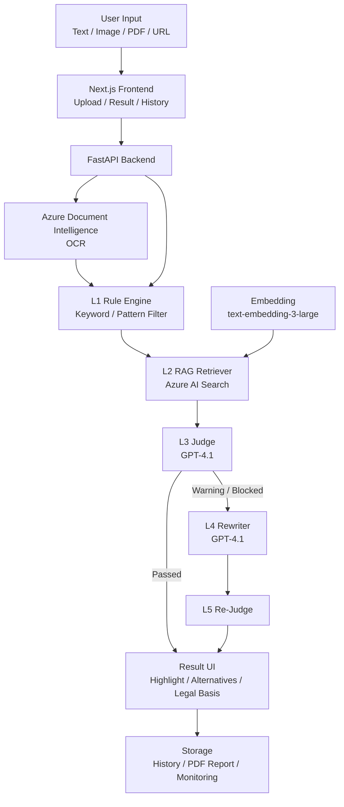

# 🛡️ AdGuard

### ✨ Azure AI 기반 화장품 광고 카피 검수 및 합법 대체 문구 제안 서비스

## ✨ Overview

AdGuard는 화장품 광고 카피가 실제 배포되기 전에 법적 리스크가 있는 표현을 탐지하고, 관련 법령 근거와 함께 실무에서 사용할 수 있는 대체 카피를 제안하는 Azure AI 기반 광고 검수 서비스입니다.

사용자는 광고 텍스트를 직접 입력하거나 이미지, PDF, URL을 업로드할 수 있습니다. 이미지와 PDF는 Azure Document Intelligence로 광고 문구를 추출하고, 추출된 텍스트는 `text-embedding-3-large`와 Azure AI Search 기반 RAG 검색을 통해 관련 법령, 의결서, 가이드라인 근거와 매칭됩니다.

이후 GPT-4.1이 광고 문구의 위반 가능성을 판정하고, 위험 문구가 발견되면 안전형, 마케팅형, 기능성형 대체 카피 3종을 생성합니다. 생성된 수정안은 다시 검수 단계를 거쳐 재위반 가능성을 줄이며, 최종 결과는 위반 문구 하이라이트, 법적 근거, 수정안, PDF 리포트, 히스토리 형태로 제공됩니다.

## 📌 Contents

- [🎯 Problem](#problem)
- [🚀 Key Features](#key-features)
- [🏗️ Architecture](#architecture)
- [🧰 Tech Stack](#tech-stack)
- [📊 Data and Metrics](#data-and-metrics)
- [👥 Team](#team)
- [🧩 Contributions](#contributions)
- [🤝 Responsible AI](#responsible-ai)
- [🗺️ Roadmap](#roadmap)

## 🎯 Problem

화장품 광고에서는 `바르는 보톡스`, `피부 재생`, `염증 완화`, `단 1회만에 개선`처럼 소비자가 제품을 의약품이나 시술로 오인할 수 있는 표현이 자주 등장합니다.

이러한 표현은 화장품법 및 표시광고법 위반으로 이어질 수 있으며, 실제 광고 중단, 행정처분, 브랜드 신뢰도 하락 같은 리스크를 만듭니다. 하지만 마케터나 소규모 브랜드가 매번 법령과 심의 기준을 직접 확인하며 광고 문구를 검수하기는 어렵습니다.

AdGuard는 광고 작성 단계에서 위험 문구 탐지, 법적 근거 제시, 대체 카피 생성을 한 번에 제공해 광고 검수 시간을 줄이고 실무자의 의사결정을 돕습니다.

## 🚀 Key Features

| Icon | 기능 | 설명 |
| --- | --- | --- |
| 📝 | 텍스트 분석 | 광고 카피를 직접 입력해 위반 가능성을 분석 |
| 🖼️ | OCR 분석 | 이미지/PDF 업로드 시 Azure Document Intelligence로 광고 문구 추출 |
| 🔗 | URL 분석 | URL 기반 광고 문구 수집 및 분석 |
| ⚡ | Rule Engine | 금지어와 위험 패턴을 L1 단계에서 빠르게 탐지 |
| 🔎 | RAG 검색 | Azure AI Search로 법령, 의결서, 가이드라인 근거 검색 |
| 🧠 | GPT 판정 | GPT-4.1이 검색 근거를 바탕으로 위반 여부와 사유 판정 |
| ✍️ | 대체 카피 생성 | 안전형, 마케팅형, 기능성형 수정안 3종 생성 |
| ✅ | Re-Judge | 생성된 수정안을 다시 검수해 재위반 가능성 감소 |
| 🧾 | 결과 UI | 위반 문구 하이라이트, Before/After 비교, 법적 근거 제공 |
| 📁 | 리포트/히스토리 | PDF 리포트와 검수 기록 저장 |

## 🏗️ Architecture

AdGuard는 단일 GPT 호출이 아니라 역할을 분리한 5-Layer Cascade 구조로 설계되었습니다.

### 🧬 5-Layer Cascade

| Icon | Layer | 역할 | 설명 |
| --- | --- | --- | --- |
| ⚡ | L1 Rule Engine | 빠른 위험 표현 탐지 | 금지어, 수치 단정, 의료/시술 오인 표현을 규칙 기반으로 탐지 |
| 🔎 | L2 RAG Retriever | 근거 검색 | Azure AI Search로 법령, 의결서, 가이드라인 근거 검색 |
| 🧠 | L3 Judge | 위반 여부 판정 | GPT-4.1이 RAG 근거를 바탕으로 위험도와 법적 근거 판정 |
| ✍️ | L4 Rewriter | 수정안 생성 | 위반 문구를 안전형, 마케팅형, 기능성형 카피로 변환 |
| ✅ | L5 Re-Judge | 수정안 재검수 | 생성된 수정안을 다시 판정해 재위반 가능성 감소 |

## 🧰 Tech Stack

| Icon | 영역 | 기술 |
| --- | --- | --- |
| 🧠 | AI Model | Azure OpenAI GPT-4.1 |
| 🧬 | Embedding | Azure OpenAI text-embedding-3-large |
| 🔎 | Search | Azure AI Search |
| 🖼️ | OCR | Azure Document Intelligence |
| 🔁 | AI Workflow | Azure AI Foundry, RAG Pipeline |
| ⚙️ | Backend | FastAPI, Azure App Service |
| 🎨 | Frontend | Next.js 14, shadcn/ui |
| 🚀 | Deploy | Azure Static Web Apps |
| 🗄️ | Storage | Azure Blob Storage, Azure SQL Database / Azure Table Storage |
| 🔐 | Security | Azure Key Vault |
| 📈 | Monitoring | Azure Application Insights |
| 🧹 | Data Processing | Python Custom Chunker |

## 📊 Data and Metrics

| Icon | 항목 | 결과 |
| --- | --- | --- |
| 📚 | 원본 데이터 | 42 PDF + 60 MD + 32 TXT |
| ✂️ | RAG 청크 | 1,069개 |
| 🔎 | Azure AI Search 인덱스 | `adguard-main` |
| 🧬 | 임베딩 모델 | `text-embedding-3-large` |
| 📐 | 벡터 차원 | 3,072차원 |
| 🧪 | Few-shot 데이터 | 254행 |
| ⚡ | L1 Rule Engine 테스트 | 24/25 통과 |
| 🧠 | Cascade 테스트 | 10건 중 9건 정확 |
| 🏁 | 내부 평가 | 67건 기준 핵심 지표 100% 달성 |
| ⏱️ | 작업 시간 개선 | 수동 검수 대비 체감 약 90% 단축 |

## 👥 Team

| Icon | 이름 | 역할 | 주요 담당 |
| --- | --- | --- | --- |
| 🧭 | 오준상 | 팀장 / AI·시스템 총괄 | L1~L5 Cascade 파이프라인 설계, Azure AI Search RAG 구조 설계, 법령·의결서 데이터 청킹/임베딩/인덱싱 전략, 모델 구조 최적화, 아키텍처 및 성능 검증 |
| 🎨 | 황유경 | 프론트엔드 | Result / History 페이지 구현, 수정안 3종 카드 UI, 신호등 위험도 Badge, Before/After Diff UI, 위반 문구 하이라이트 및 책임있는 AI UI 개선 |
| ⚙️ | 오효석 | 백엔드 | FastAPI 서버 구축, L1~L3 분석 파이프라인 구현, Azure 리소스 생성, API 연결 및 최적화, 병렬 처리와 배포 안정화 |
| 🧪 | 조윤지 | 데이터 / AI 보조 | 화장품 광고 위반/정상 사례 수집, Few-shot 데이터셋 구축, L4 Rewriter 스타일 기준 정리, 광고 카피 카테고리 분류와 발표 흐름 보강 |
| 🖼️ | 김시현 | 프론트엔드 | Upload 페이지 구현, Azure Document Intelligence OCR 연동, 이미지/PDF 업로드 UX, L1~L5 분석 단계 로딩 시각화, Azure Static Web Apps 배포 |
| 🗄️ | 백혁빈 | 백엔드 / 데이터 | L1~L5 파이프라인 구현 지원, Rewriter / Re-Judge 로직 개발, PDF 리포트 생성, DB 저장 구조, 히스토리 기능, 보안·모니터링 구조 정리 |

## 🧩 Contributions

### 🧭 오준상

팀장으로서 AdGuard의 AI 파이프라인과 전체 시스템 아키텍처를 총괄했습니다. 단순히 GPT-4.1에 광고 문구를 한 번 입력해 판단하는 구조가 아니라, 빠른 규칙 기반 탐지, 법령 근거 검색, LLM 판정, 대체 카피 생성, 재검증을 분리한 5-Layer Cascade 구조를 설계했습니다.

또한 법령, 의결서, 가이드라인, 광고 사례 데이터를 RAG 검색에 적합하도록 청킹하고, `text-embedding-3-large`와 Azure AI Search를 활용해 검색 가능한 형태로 구성하는 전략을 정리했습니다. 발표와 구현 과정에서는 아키텍처 흐름, 모델 판단 구조, 성능 검증 기준, 팀원별 역할 분배를 조율했습니다.

### 🎨 황유경

Result / History 페이지를 중심으로 사용자가 분석 결과를 이해하고 다시 활용할 수 있는 UI를 구현했습니다. GPT-4.1이 생성한 수정안 3종을 카드 형태로 보여주고, 위험도를 신호등 Badge와 텍스트로 함께 표시해 결과를 빠르게 파악할 수 있도록 구성했습니다.

Before/After 비교 UI에서는 원본 광고 문구와 AI 수정안을 나란히 배치하고, 위반 의심 문구를 하이라이트해 사용자가 어떤 부분이 문제인지 직관적으로 이해할 수 있게 했습니다. 또한 색상에만 의존하지 않는 위험도 표시, 설명 가능한 AI UI, 사용자 피드백 흐름 등 책임있는 AI 원칙을 프론트엔드 경험에 반영했습니다.

### ⚙️ 오효석

FastAPI 기반 백엔드 서버와 L1~L3 분석 파이프라인을 구축했습니다. 광고 문구 입력을 받아 Rule Engine, Azure AI Search Retriever, GPT-4.1 Judge로 이어지는 초기 판정 흐름을 구성하고, 프론트엔드와 API가 연결될 수 있도록 서버 구조를 정리했습니다.

Azure 리소스 생성과 환경 변수 설정, API 연결, 모델 결합 테스트, 병렬 처리와 배포 안정화 작업을 담당했습니다. 분석 요청이 실제 서비스 흐름에서 안정적으로 처리될 수 있도록 백엔드 성능과 운영 안정성을 개선했습니다.

### 🧪 조윤지

AdGuard의 판단 품질과 대체 카피 품질을 높이기 위한 데이터셋 구축을 담당했습니다. 실제 화장품 광고의 위반 사례와 정상 사례를 수집하고, 의약품 오인, 기능성 오인, 수치·효과 과장 등 주요 위반 유형을 정리했습니다.

Few-shot 데이터셋과 L4 Rewriter 스타일 기준을 구성해 GPT-4.1이 단순히 방어적인 문구만 생성하지 않고, 법적 기준 안에서 마케팅 가치가 살아 있는 대체 카피를 만들 수 있도록 지원했습니다. 또한 발표 흐름에서 서비스 가치와 사용 시나리오를 설명하는 파트를 보강했습니다.

### 🖼️ 김시현

사용자가 광고 문구를 입력하는 Upload 페이지와 OCR 기반 입력 UX를 구현했습니다. 텍스트 입력뿐 아니라 이미지와 PDF 업로드를 지원하고, Azure Document Intelligence를 연동해 파일 속 광고 문구를 자동으로 추출하는 흐름을 구성했습니다.

분석 과정에서는 L1~L5 단계가 어떻게 진행되는지 사용자가 볼 수 있도록 로딩 상태와 진행 메시지를 시각화했습니다. 또한 데이터 처리 동의 체크박스, 드래그 앤 드롭 업로드, 썸네일 미리보기, Azure Static Web Apps 배포 등 실제 사용성과 배포 완성도를 높이는 작업을 담당했습니다.

### 🗄️ 백혁빈

백엔드 파이프라인과 데이터 저장 구조를 중심으로 구현을 담당했습니다. L1~L5 분석 흐름이 서비스 안에서 연결될 수 있도록 Rewriter와 Re-Judge 로직을 개발하고, 생성된 대체 카피가 다시 검수되는 구조를 정리했습니다.

PDF 리포트 생성 기능과 검수 히스토리 저장 구조를 구현해 분석 결과가 단순 화면 출력에 그치지 않고, 보고 자료와 사후 관리 데이터로 남을 수 있도록 했습니다. 또한 DB 저장, 보안 처리, 모니터링 구조를 정리해 서비스 운영 안정성을 높였습니다.

## ⭐ My Contribution

- L1~L5 Cascade 파이프라인 구조 설계
- Azure AI Search 기반 RAG 검색 흐름 설계
- 법령·의결서·광고 사례 데이터 청킹 전략 수립
- `text-embedding-3-large` 기반 임베딩/인덱싱 전략 정리
- GPT-4.1 Judge / Rewriter / Re-Judge 흐름 설계
- 모델 구조 최적화 및 latency 개선 방향 정리
- 발표용 시스템 아키텍처 및 서비스 흐름 정리
- 팀 일정, 역할 분배, 발표 구조 조율

## 🤝 Responsible AI

AdGuard는 Microsoft Responsible AI 원칙을 서비스 기능에 반영했습니다.

| Icon | 원칙 | 적용 방식 |
| --- | --- | --- |
| 🔍 | 투명성 | L1~L5 분석 단계를 사용자에게 실시간으로 표시 |
| 💬 | 설명 가능성 | 위반 문구와 법적 근거를 함께 제공 |
| 🧾 | 책임성 | 최종 판단 책임이 사용자에게 있음을 명시 |
| ⚖️ | 공정성 | 일반 화장품과 기능성 화장품을 구분해 판정 기준 적용 |
| 🛡️ | 안정성 | 생성된 수정안을 다시 검수하는 Re-Judge 구조 적용 |
| 🔐 | 개인정보 보호 | 광고 카피와 제품 정보 외 불필요한 개인정보 수집 최소화 |
| ♿ | 포용성 | 색상뿐 아니라 아이콘과 텍스트를 함께 사용해 위험도 표시 |

## 🗺️ Roadmap

- 건강기능식품, 의료광고 등 규제 도메인 확장
- 쇼핑몰/광고대행사 대상 B2B API 제공
- 검수 히스토리 기반 대시보드 고도화
- 수정안 선택 데이터를 활용한 Few-shot 데이터 플라이휠 구축
- 스트리밍과 캐싱을 통한 응답 시간 개선

## 🧾 Portfolio Summary

AdGuard는 Azure AI 기반 화장품 광고 검수 서비스입니다. 광고 카피, 이미지, PDF, URL을 입력하면 `text-embedding-3-large`와 Azure AI Search 기반 법령·의결서·가이드라인 RAG 검색으로 위반 가능성을 판정하고, GPT-4.1을 활용해 안전한 대체 카피 3종과 PDF 리포트를 제공합니다.

- 기간: 2026.04.14 ~ 2026.04.27
- 역할: 팀장 / AI·시스템 총괄
- 담당: 5-Layer Cascade 설계, Azure AI Search RAG 구조 설계, 데이터 청킹·인덱싱 전략, GPT-4.1 Judge/Rewriter/Re-Judge 흐름 설계
- 기술: Azure OpenAI GPT-4.1, Azure OpenAI text-embedding-3-large, Azure AI Search, Azure Document Intelligence, FastAPI, Next.js, Azure App Service, Azure Static Web Apps
